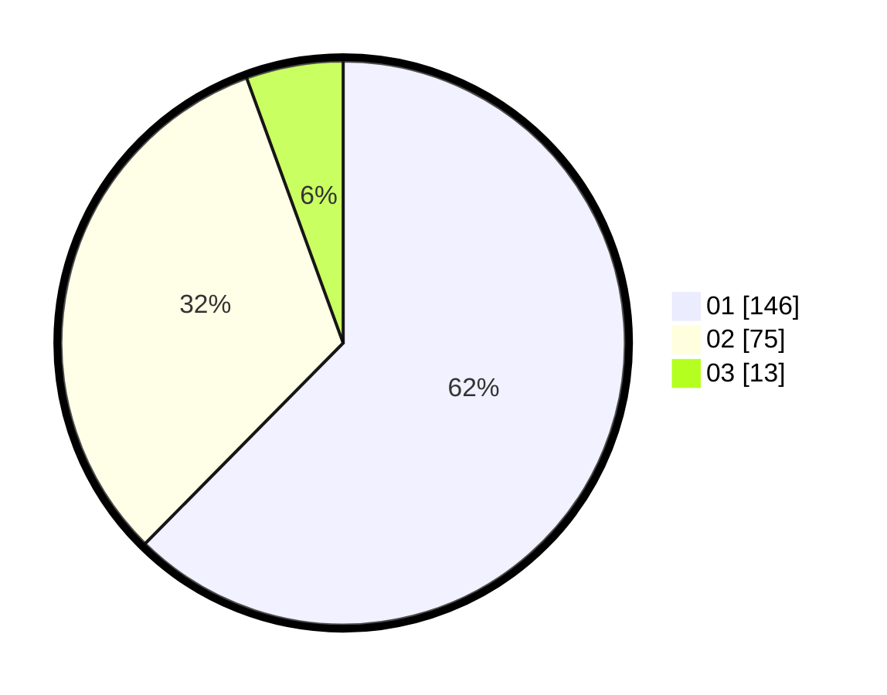

# Hasil

Hasil perolehan suara paslon dapat dilihat pada file paslon-01.txt, paslon-02.txt, dan paslon-03.txt.

Jika tidak ada, artinya data tersebut belum ada pada SIREKAP.

## Perolehan Suara

 * Paslon 01: **146**.
 * Paslon 02: **75**.
 * Paslon 03: **13**.

## Foto C Plano

https://sirekap-obj-formc.kpu.go.id/6a5e/pemilu/ppwp/31/71/01/10/04/3171011004002-20240216-145453--ee64db53-f119-4b4c-988f-3f0a3735c790.jpg

https://sirekap-obj-formc.kpu.go.id/6a5e/pemilu/ppwp/31/71/01/10/04/3171011004002-20240216-145455--739ca811-0b74-4d33-9aa8-6a4af31d857b.jpg

https://sirekap-obj-formc.kpu.go.id/6a5e/pemilu/ppwp/31/71/01/10/04/3171011004002-20240216-145454--753b5022-65d9-4909-8495-701d857c3a75.jpg

## DATA PEMILIH TETAP

Jumlah pemilih dalam DPT: **272**.
 * L: **133**.
 * P: **139**.

## DATA PENGGUNA HAK PILIH

Jumlah pengguna hak pilih dalam DPT: **234**.
 * L: **113**.
 * P: **121**.

Jumlah pengguna hak pilih dalam DPTb: **14**.
 * L: **8**.
 * P: **6**.

Jumlah pengguna hak pilih dalam DPK: **1**.
 * L: **0**.
 * P: **1**.

Jumlah pengguna hak pilih: **249**.
 * L: **121**.
 * P: **128**.

## JUMLAH SUARA SAH DAN TIDAK SAH

JUMLAH SELURUH SUARA SAH: **234**.

JUMLAH SUARA TIDAK SAH: **4**.

JUMLAH SELURUH SUARA SAH DAN SUARA TIDAK SAH: **238**.
