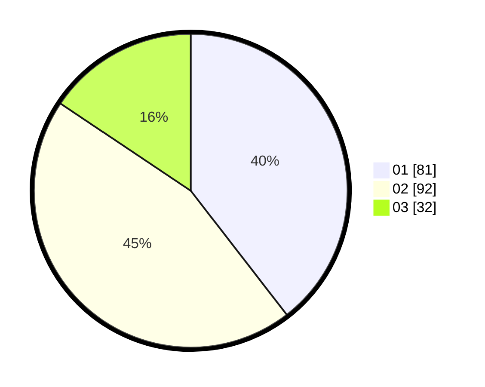

# Hasil

Hasil perolehan suara paslon dapat dilihat pada file paslon-01.txt, paslon-02.txt, dan paslon-03.txt.

Jika tidak ada, artinya data tersebut belum ada pada SIREKAP.

## Perolehan Suara

 * Paslon 01: **81**.
 * Paslon 02: **92**.
 * Paslon 03: **32**.

## Foto C Plano

https://sirekap-obj-formc.kpu.go.id/fe72/pemilu/ppwp/31/71/01/10/04/3171011004009-20240214-215541--04a0aad7-90dc-4f43-8444-c0ca77164fb8.jpg

https://sirekap-obj-formc.kpu.go.id/fe72/pemilu/ppwp/31/71/01/10/04/3171011004009-20240214-215638--e2f3183d-e407-4008-b778-c8949904268d.jpg

https://sirekap-obj-formc.kpu.go.id/fe72/pemilu/ppwp/31/71/01/10/04/3171011004009-20240214-215722--dec92e83-5acd-4943-9a4a-449a13585123.jpg

## DATA PEMILIH TETAP

Jumlah pemilih dalam DPT: **275**.
 * L: **140**.
 * P: **135**.

## DATA PENGGUNA HAK PILIH

Jumlah pengguna hak pilih dalam DPT: **190**.
 * L: **96**.
 * P: **94**.

Jumlah pengguna hak pilih dalam DPTb: **15**.
 * L: **7**.
 * P: **8**.

Jumlah pengguna hak pilih dalam DPK: **2**.
 * L: **1**.
 * P: **1**.

Jumlah pengguna hak pilih: **207**.
 * L: **104**.
 * P: **103**.

## JUMLAH SUARA SAH DAN TIDAK SAH

JUMLAH SELURUH SUARA SAH: **205**.

JUMLAH SUARA TIDAK SAH: **2**.

JUMLAH SELURUH SUARA SAH DAN SUARA TIDAK SAH: **207**.
