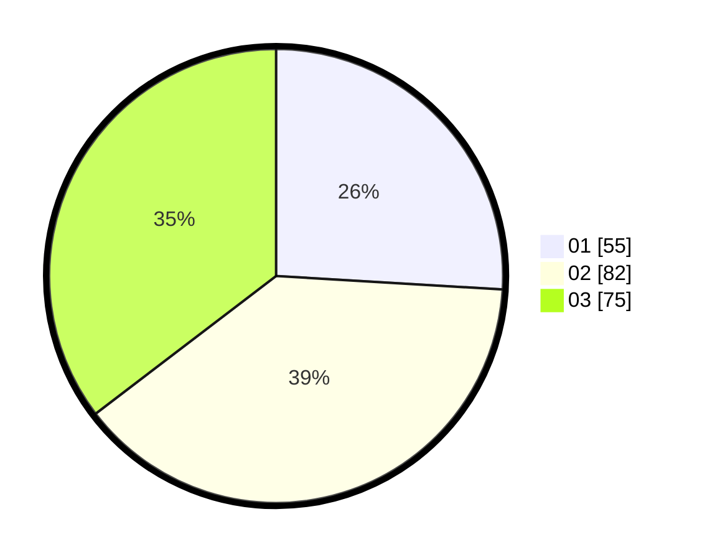

# Hasil

Hasil perolehan suara paslon dapat dilihat pada file paslon-01.txt, paslon-02.txt, dan paslon-03.txt.

Jika tidak ada, artinya data tersebut belum ada pada SIREKAP.

## Perolehan Suara

 * Paslon 01: **55**.
 * Paslon 02: **82**.
 * Paslon 03: **75**.

## Foto C Plano

https://sirekap-obj-formc.kpu.go.id/1125/pemilu/ppwp/31/71/01/10/04/3171011004014-20240215-005635--3ecbb560-3177-4322-a9e1-4a9d9d13d2fc.jpg

https://sirekap-obj-formc.kpu.go.id/1125/pemilu/ppwp/31/71/01/10/04/3171011004014-20240215-005148--69b5b78b-595b-4b6f-9d94-be346dd49176.jpg

https://sirekap-obj-formc.kpu.go.id/1125/pemilu/ppwp/31/71/01/10/04/3171011004014-20240215-005435--95a940e8-c970-4221-94d9-91f5351a6bda.jpg
