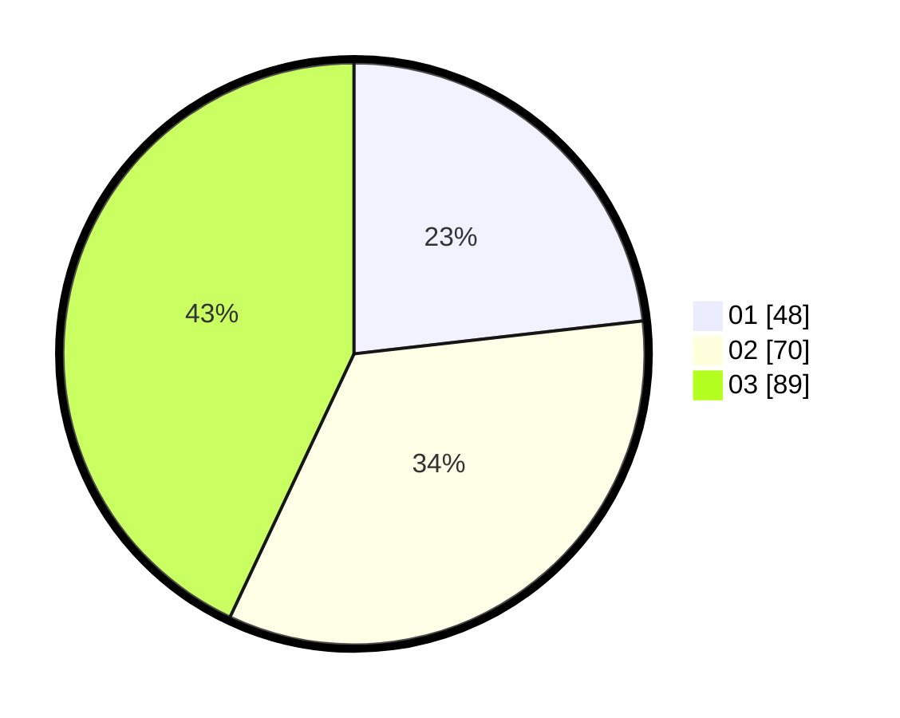

# Hasil

Hasil perolehan suara paslon dapat dilihat pada file paslon-01.txt, paslon-02.txt, dan paslon-03.txt.

Jika tidak ada, artinya data tersebut belum ada pada SIREKAP.

## Perolehan Suara

 * Paslon 01: **48**.
 * Paslon 02: **70**.
 * Paslon 03: **89**.

## Foto C Plano

https://sirekap-obj-formc.kpu.go.id/9306/pemilu/ppwp/31/71/01/10/04/3171011004015-20240214-155126--28a7b574-137a-4971-8d22-175264af3bde.jpg

https://sirekap-obj-formc.kpu.go.id/9306/pemilu/ppwp/31/71/01/10/04/3171011004015-20240214-155914--2ac59bf4-011a-4d4a-ac85-6c433a65f004.jpg

https://sirekap-obj-formc.kpu.go.id/9306/pemilu/ppwp/31/71/01/10/04/3171011004015-20240214-160113--c45d70ea-19f8-4429-a0f4-eb8986c03f3e.jpg

## DATA PEMILIH TETAP

Jumlah pemilih dalam DPT: **184**.
 * L: **83**.
 * P: **101**.

## DATA PENGGUNA HAK PILIH

Jumlah pengguna hak pilih dalam DPT: **184**.
 * L: **83**.
 * P: **101**.

Jumlah pengguna hak pilih dalam DPTb: **19**.
 * L: **9**.
 * P: **10**.

Jumlah pengguna hak pilih dalam DPK: **5**.
 * L: **3**.
 * P: **2**.

Jumlah pengguna hak pilih: **208**.
 * L: **95**.
 * P: **113**.

## JUMLAH SUARA SAH DAN TIDAK SAH

JUMLAH SELURUH SUARA SAH: **207**.

JUMLAH SUARA TIDAK SAH: **1**.

JUMLAH SELURUH SUARA SAH DAN SUARA TIDAK SAH: **208**.
