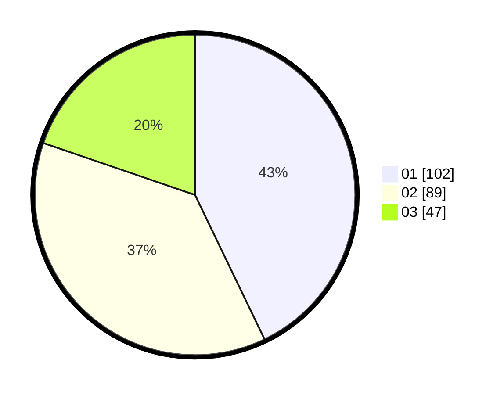

# Hasil

Hasil perolehan suara paslon dapat dilihat pada file paslon-01.txt, paslon-02.txt, dan paslon-03.txt.

Jika tidak ada, artinya data tersebut belum ada pada SIREKAP.

## Perolehan Suara

 * Paslon 01: **102**.
 * Paslon 02: **89**.
 * Paslon 03: **47**.

## Foto C Plano

https://sirekap-obj-formc.kpu.go.id/9403/pemilu/ppwp/31/71/01/10/04/3171011004016-20240216-164158--1c370aa7-85aa-430b-8d8a-6cc59bfd7122.jpg

https://sirekap-obj-formc.kpu.go.id/9403/pemilu/ppwp/31/71/01/10/04/3171011004016-20240216-164159--85808b36-6406-4fdf-b965-9bdf5b465f3c.jpg

https://sirekap-obj-formc.kpu.go.id/9403/pemilu/ppwp/31/71/01/10/04/3171011004016-20240216-164158--b15f23a4-f4b5-440a-a994-5f231db4f109.jpg

## DATA PEMILIH TETAP

Jumlah pemilih dalam DPT: **271**.
 * L: **123**.
 * P: **148**.

## DATA PENGGUNA HAK PILIH

Jumlah pengguna hak pilih dalam DPT: **222**.
 * L: **102**.
 * P: **120**.

Jumlah pengguna hak pilih dalam DPTb: **13**.
 * L: **6**.
 * P: **7**.

Jumlah pengguna hak pilih dalam DPK: **5**.
 * L: **4**.
 * P: **1**.

Jumlah pengguna hak pilih: **240**.
 * L: **0**.
 * P: **0**.

## JUMLAH SUARA SAH DAN TIDAK SAH

JUMLAH SELURUH SUARA SAH: **238**.

JUMLAH SUARA TIDAK SAH: **2**.

JUMLAH SELURUH SUARA SAH DAN SUARA TIDAK SAH: **240**.
