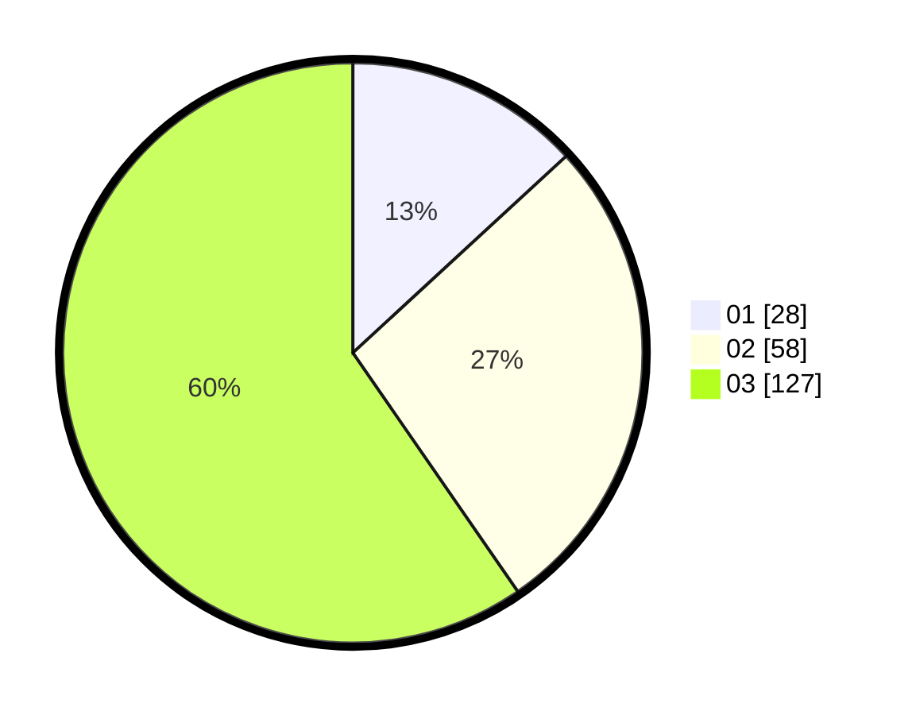

# Hasil

Hasil perolehan suara paslon dapat dilihat pada file paslon-01.txt, paslon-02.txt, dan paslon-03.txt.

Jika tidak ada, artinya data tersebut belum ada pada SIREKAP.

## Perolehan Suara

 * Paslon 01: **28**.
 * Paslon 02: **58**.
 * Paslon 03: **127**.

## Foto C Plano

https://sirekap-obj-formc.kpu.go.id/1cf7/pemilu/ppwp/31/71/01/10/04/3171011004028-20240214-224454--95999026-ff4c-4239-bd05-4a6fa4a8291d.jpg

https://sirekap-obj-formc.kpu.go.id/1cf7/pemilu/ppwp/31/71/01/10/04/3171011004028-20240214-225529--a5e2350b-043e-4496-8afe-c66f14815285.jpg
