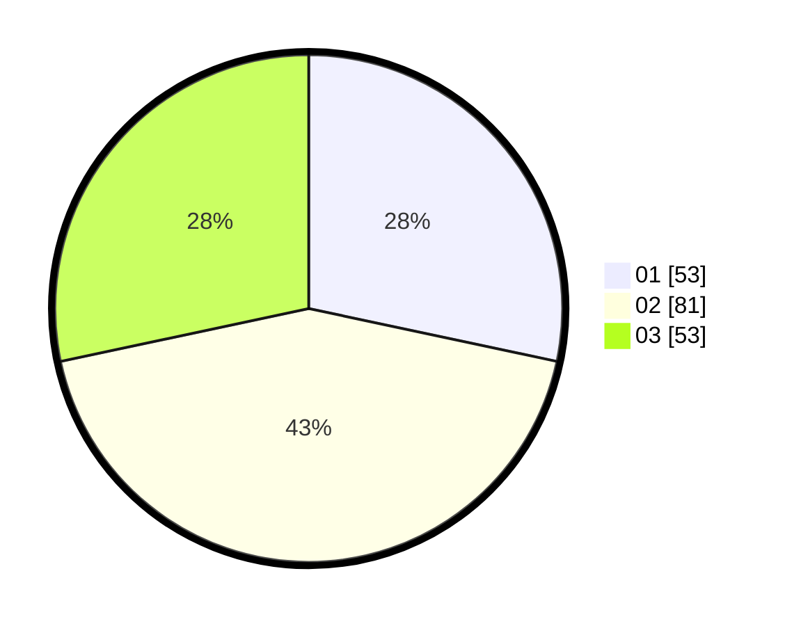

# Hasil

Hasil perolehan suara paslon dapat dilihat pada file paslon-01.txt, paslon-02.txt, dan paslon-03.txt.

Jika tidak ada, artinya data tersebut belum ada pada SIREKAP.

## Perolehan Suara

 * Paslon 01: **53**.
 * Paslon 02: **81**.
 * Paslon 03: **53**.

## Foto C Plano

https://sirekap-obj-formc.kpu.go.id/0d90/pemilu/ppwp/31/71/01/10/04/3171011004029-20240216-033646--5de59121-2c6d-4314-a278-538f848e23bc.jpg

https://sirekap-obj-formc.kpu.go.id/0d90/pemilu/ppwp/31/71/01/10/04/3171011004029-20240216-135412--a939e165-37d2-49fb-895a-956e93936f95.jpg

https://sirekap-obj-formc.kpu.go.id/0d90/pemilu/ppwp/31/71/01/10/04/3171011004029-20240216-135411--c7b92b24-a10c-4b2d-b462-1c25deba4ffb.jpg

## DATA PEMILIH TETAP

Jumlah pemilih dalam DPT: **263**.
 * L: **141**.
 * P: **122**.

## DATA PENGGUNA HAK PILIH

Jumlah pengguna hak pilih dalam DPT: **176**.
 * L: **89**.
 * P: **87**.

Jumlah pengguna hak pilih dalam DPTb: **12**.
 * L: **4**.
 * P: **8**.

Jumlah pengguna hak pilih dalam DPK: **2**.
 * L: **0**.
 * P: **2**.

Jumlah pengguna hak pilih: **190**.
 * L: **93**.
 * P: **97**.

## JUMLAH SUARA SAH DAN TIDAK SAH

JUMLAH SELURUH SUARA SAH: **187**.

JUMLAH SUARA TIDAK SAH: **3**.

JUMLAH SELURUH SUARA SAH DAN SUARA TIDAK SAH: **190**.
