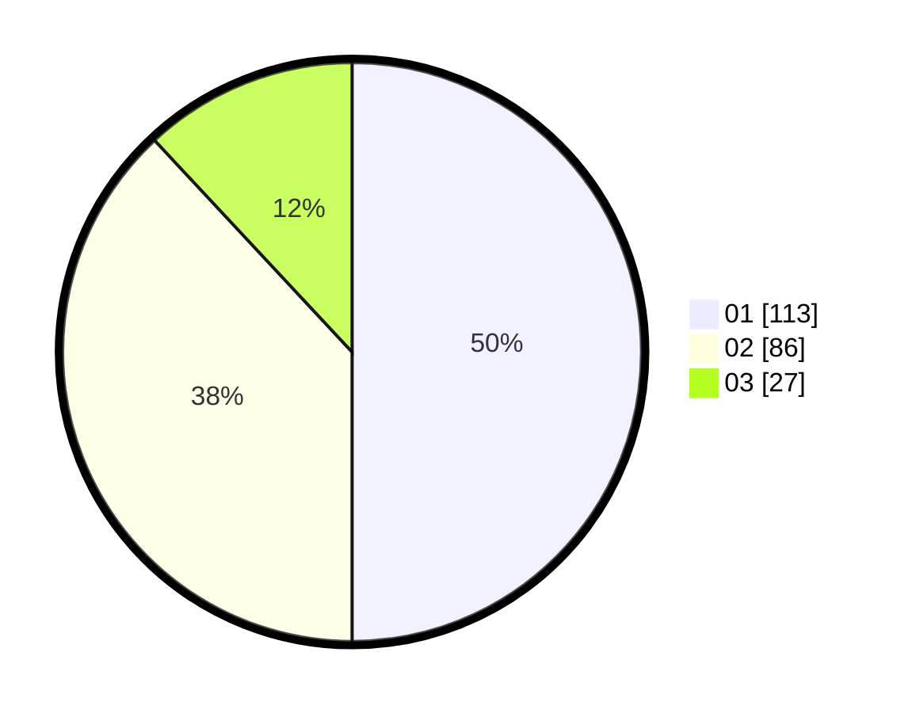

# Hasil

Hasil perolehan suara paslon dapat dilihat pada file paslon-01.txt, paslon-02.txt, dan paslon-03.txt.

Jika tidak ada, artinya data tersebut belum ada pada SIREKAP.

## Perolehan Suara

 * Paslon 01: **113**.
 * Paslon 02: **86**.
 * Paslon 03: **27**.

## Foto C Plano

https://sirekap-obj-formc.kpu.go.id/6df1/pemilu/ppwp/31/71/01/10/04/3171011004034-20240214-155517--41e7c70d-fdee-47ec-888e-196cf53a24f0.jpg

https://sirekap-obj-formc.kpu.go.id/6df1/pemilu/ppwp/31/71/01/10/04/3171011004034-20240214-184700--12e1261b-9523-4a74-94f9-b2f8b1a065e0.jpg

https://sirekap-obj-formc.kpu.go.id/6df1/pemilu/ppwp/31/71/01/10/04/3171011004034-20240214-155622--aa5d8be1-5a90-45c0-8548-bb15b404fd2b.jpg

## DATA PEMILIH TETAP

Jumlah pemilih dalam DPT: **219**.
 * L: **110**.
 * P: **109**.

## DATA PENGGUNA HAK PILIH

Jumlah pengguna hak pilih dalam DPT: **219**.
 * L: **110**.
 * P: **109**.

Jumlah pengguna hak pilih dalam DPTb: **7**.
 * L: **3**.
 * P: **4**.

Jumlah pengguna hak pilih dalam DPK: **1**.
 * L: **0**.
 * P: **1**.

Jumlah pengguna hak pilih: **227**.
 * L: **113**.
 * P: **114**.

## JUMLAH SUARA SAH DAN TIDAK SAH

JUMLAH SELURUH SUARA SAH: **226**.

JUMLAH SUARA TIDAK SAH: **1**.

JUMLAH SELURUH SUARA SAH DAN SUARA TIDAK SAH: **227**.
