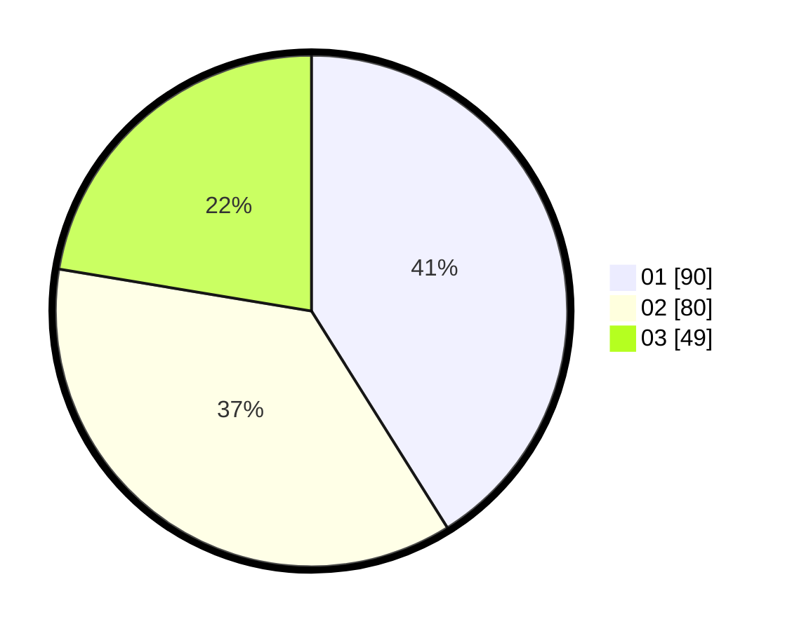

# Hasil

Hasil perolehan suara paslon dapat dilihat pada file paslon-01.txt, paslon-02.txt, dan paslon-03.txt.

Jika tidak ada, artinya data tersebut belum ada pada SIREKAP.

## Perolehan Suara

 * Paslon 01: **90**.
 * Paslon 02: **80**.
 * Paslon 03: **49**.

## Foto C Plano

https://sirekap-obj-formc.kpu.go.id/10b2/pemilu/ppwp/31/71/01/10/04/3171011004036-20240216-193026--268ce70e-90c6-4c6b-9a60-5c8e2ea34315.jpg

https://sirekap-obj-formc.kpu.go.id/10b2/pemilu/ppwp/31/71/01/10/04/3171011004036-20240216-194135--2aef870e-c082-4851-b88b-32f0c9944276.jpg

https://sirekap-obj-formc.kpu.go.id/10b2/pemilu/ppwp/31/71/01/10/04/3171011004036-20240216-194708--8fb5cc9c-541d-409e-8ca4-67d4d7b17dda.jpg

## DATA PEMILIH TETAP

Jumlah pemilih dalam DPT: **289**.
 * L: **139**.
 * P: **150**.

## DATA PENGGUNA HAK PILIH

Jumlah pengguna hak pilih dalam DPT: **217**.
 * L: **104**.
 * P: **113**.

Jumlah pengguna hak pilih dalam DPTb: **9**.
 * L: **4**.
 * P: **5**.

Jumlah pengguna hak pilih dalam DPK: **0**.
 * L: **0**.
 * P: **0**.

Jumlah pengguna hak pilih: **226**.
 * L: **108**.
 * P: **118**.

## JUMLAH SUARA SAH DAN TIDAK SAH

JUMLAH SELURUH SUARA SAH: **219**.

JUMLAH SUARA TIDAK SAH: **7**.

JUMLAH SELURUH SUARA SAH DAN SUARA TIDAK SAH: **226**.
