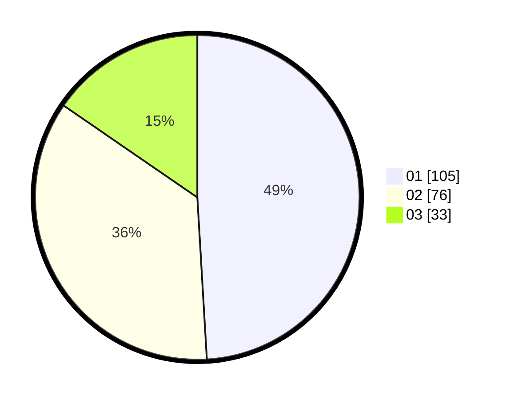

# Hasil

Hasil perolehan suara paslon dapat dilihat pada file paslon-01.txt, paslon-02.txt, dan paslon-03.txt.

Jika tidak ada, artinya data tersebut belum ada pada SIREKAP.

## Perolehan Suara

 * Paslon 01: **105**.
 * Paslon 02: **76**.
 * Paslon 03: **33**.

## Foto C Plano

https://sirekap-obj-formc.kpu.go.id/c9f7/pemilu/ppwp/31/71/01/10/04/3171011004037-20240216-074729--25734ad7-e5bd-4cdd-80a8-ba599f47c795.jpg

https://sirekap-obj-formc.kpu.go.id/c9f7/pemilu/ppwp/31/71/01/10/04/3171011004037-20240216-075844--28177e8d-6a2b-43c4-9628-5ce539a671ef.jpg

https://sirekap-obj-formc.kpu.go.id/c9f7/pemilu/ppwp/31/71/01/10/04/3171011004037-20240216-074735--bf9d4ac7-2e05-42f1-b9c5-300892a89818.jpg

## DATA PEMILIH TETAP

Jumlah pemilih dalam DPT: **289**.
 * L: **150**.
 * P: **139**.

## DATA PENGGUNA HAK PILIH

Jumlah pengguna hak pilih dalam DPT: **196**.
 * L: **95**.
 * P: **101**.

Jumlah pengguna hak pilih dalam DPTb: **11**.
 * L: **5**.
 * P: **6**.

Jumlah pengguna hak pilih dalam DPK: **12**.
 * L: **3**.
 * P: **9**.

Jumlah pengguna hak pilih: **219**.
 * L: **103**.
 * P: **116**.

## JUMLAH SUARA SAH DAN TIDAK SAH

JUMLAH SELURUH SUARA SAH: **214**.

JUMLAH SUARA TIDAK SAH: **5**.

JUMLAH SELURUH SUARA SAH DAN SUARA TIDAK SAH: **219**.
