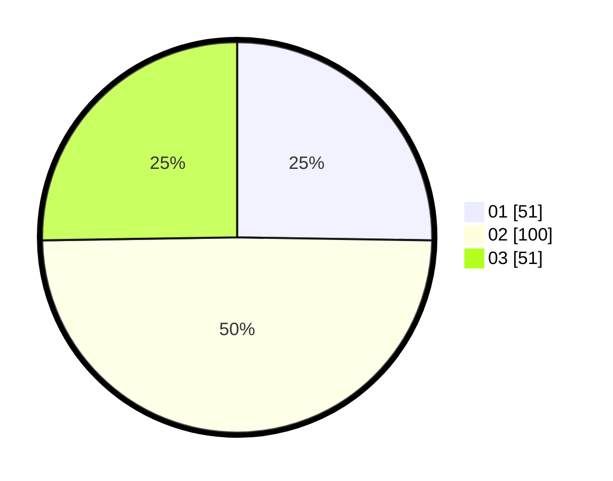

# Hasil

Hasil perolehan suara paslon dapat dilihat pada file paslon-01.txt, paslon-02.txt, dan paslon-03.txt.

Jika tidak ada, artinya data tersebut belum ada pada SIREKAP.

## Perolehan Suara

 * Paslon 01: **51**.
 * Paslon 02: **100**.
 * Paslon 03: **51**.

## Foto C Plano

https://sirekap-obj-formc.kpu.go.id/97ba/pemilu/ppwp/31/71/01/10/04/3171011004038-20240215-012314--784ded39-89e1-4aed-9148-884c05a10870.jpg

https://sirekap-obj-formc.kpu.go.id/97ba/pemilu/ppwp/31/71/01/10/04/3171011004038-20240215-012153--408819b4-f4a3-4aa6-a3f7-fc3244ca329d.jpg

https://sirekap-obj-formc.kpu.go.id/97ba/pemilu/ppwp/31/71/01/10/04/3171011004038-20240215-012111--8c8bd459-1784-4cbe-aaef-3ef2fe15ba51.jpg
