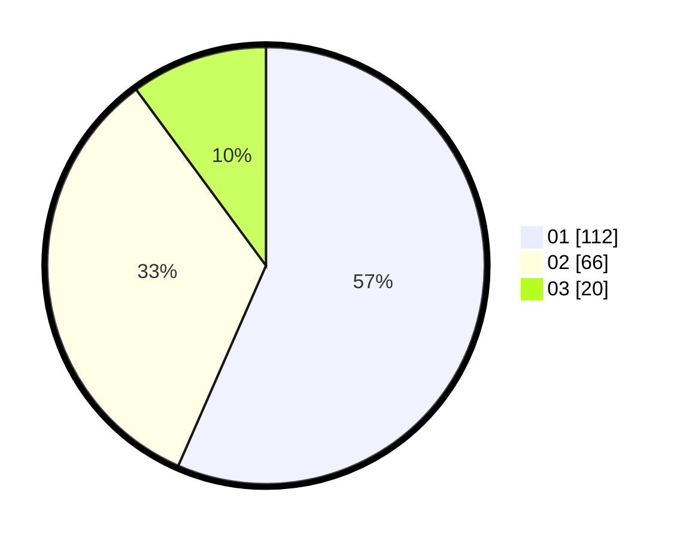

# Hasil

Hasil perolehan suara paslon dapat dilihat pada file paslon-01.txt, paslon-02.txt, dan paslon-03.txt.

Jika tidak ada, artinya data tersebut belum ada pada SIREKAP.

## Perolehan Suara

 * Paslon 01: **112**.
 * Paslon 02: **66**.
 * Paslon 03: **20**.

## Foto C Plano

https://sirekap-obj-formc.kpu.go.id/d5a5/pemilu/ppwp/31/71/01/10/04/3171011004041-20240216-215345--3b2f40bc-2e1a-4b1a-a5f2-2f250d95857f.jpg

https://sirekap-obj-formc.kpu.go.id/d5a5/pemilu/ppwp/31/71/01/10/04/3171011004041-20240216-215346--e88e3dc2-b3b9-4074-bd3d-3131b63f026d.jpg

https://sirekap-obj-formc.kpu.go.id/d5a5/pemilu/ppwp/31/71/01/10/04/3171011004041-20240216-215345--8d759828-b9c1-41f7-8d13-dc04ae4baebf.jpg

## DATA PEMILIH TETAP

Jumlah pemilih dalam DPT: **273**.
 * L: **138**.
 * P: **135**.

## DATA PENGGUNA HAK PILIH

Jumlah pengguna hak pilih dalam DPT: **193**.
 * L: **98**.
 * P: **95**.

Jumlah pengguna hak pilih dalam DPTb: **9**.
 * L: **6**.
 * P: **3**.

Jumlah pengguna hak pilih dalam DPK: **0**.
 * L: **0**.
 * P: **0**.

Jumlah pengguna hak pilih: **202**.
 * L: **104**.
 * P: **98**.

## JUMLAH SUARA SAH DAN TIDAK SAH

JUMLAH SELURUH SUARA SAH: **198**.

JUMLAH SUARA TIDAK SAH: **4**.

JUMLAH SELURUH SUARA SAH DAN SUARA TIDAK SAH: **202**.
