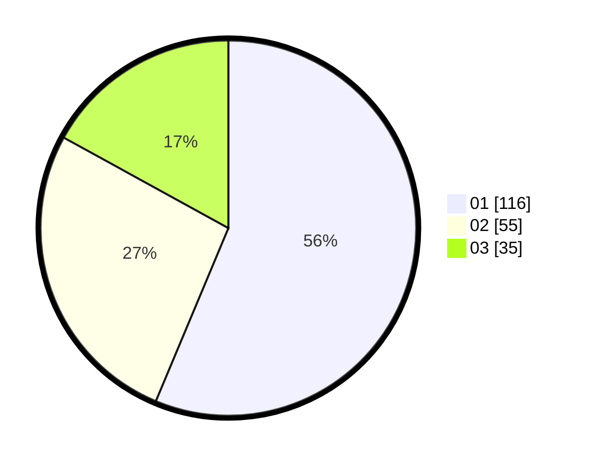

# Hasil

Hasil perolehan suara paslon dapat dilihat pada file paslon-01.txt, paslon-02.txt, dan paslon-03.txt.

Jika tidak ada, artinya data tersebut belum ada pada SIREKAP.

## Perolehan Suara

 * Paslon 01: **116**.
 * Paslon 02: **55**.
 * Paslon 03: **35**.

## Foto C Plano

https://sirekap-obj-formc.kpu.go.id/2a32/pemilu/ppwp/31/71/01/10/04/3171011004042-20240216-190413--149cde3c-d846-466e-a74b-1628b332af00.jpg

https://sirekap-obj-formc.kpu.go.id/2a32/pemilu/ppwp/31/71/01/10/04/3171011004042-20240216-190415--22cffa1a-f72d-4083-88ac-101ce5de18e0.jpg

https://sirekap-obj-formc.kpu.go.id/2a32/pemilu/ppwp/31/71/01/10/04/3171011004042-20240216-190414--521eeb92-87e8-4fad-878a-a8c8361afda9.jpg

## DATA PEMILIH TETAP

Jumlah pemilih dalam DPT: **272**.
 * L: **144**.
 * P: **128**.

## DATA PENGGUNA HAK PILIH

Jumlah pengguna hak pilih dalam DPT: **197**.
 * L: **101**.
 * P: **96**.

Jumlah pengguna hak pilih dalam DPTb: **10**.
 * L: **6**.
 * P: **4**.

Jumlah pengguna hak pilih dalam DPK: **0**.
 * L: **0**.
 * P: **0**.

Jumlah pengguna hak pilih: **207**.
 * L: **107**.
 * P: **100**.

## JUMLAH SUARA SAH DAN TIDAK SAH

JUMLAH SELURUH SUARA SAH: **206**.

JUMLAH SUARA TIDAK SAH: **1**.

JUMLAH SELURUH SUARA SAH DAN SUARA TIDAK SAH: **207**.
