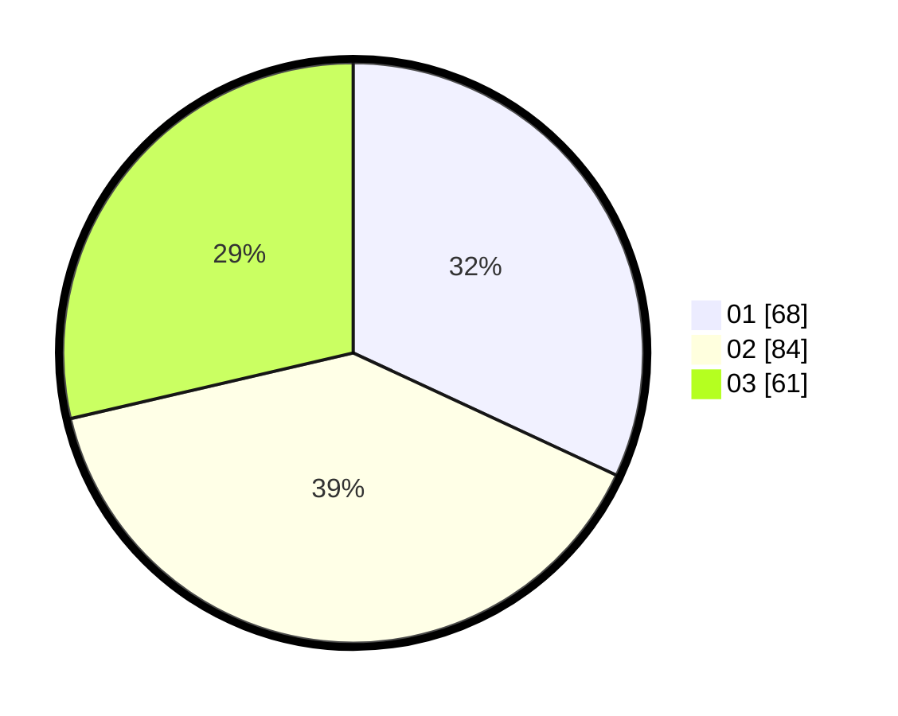

# Hasil

Hasil perolehan suara paslon dapat dilihat pada file paslon-01.txt, paslon-02.txt, dan paslon-03.txt.

Jika tidak ada, artinya data tersebut belum ada pada SIREKAP.

## Perolehan Suara

 * Paslon 01: **68**.
 * Paslon 02: **84**.
 * Paslon 03: **61**.

## Foto C Plano

https://sirekap-obj-formc.kpu.go.id/2c75/pemilu/ppwp/31/71/01/10/05/3171011005004-20240215-150017--7ed9b1bd-3151-405d-9982-c84613959e1a.jpg

https://sirekap-obj-formc.kpu.go.id/2c75/pemilu/ppwp/31/71/01/10/05/3171011005004-20240215-150039--b8931f4f-1e30-4597-90b0-633be09ffab6.jpg

https://sirekap-obj-formc.kpu.go.id/2c75/pemilu/ppwp/31/71/01/10/05/3171011005004-20240215-150027--000908dd-7c7b-4b88-add3-92bbb7c1782e.jpg

## DATA PEMILIH TETAP

Jumlah pemilih dalam DPT: **266**.
 * L: **130**.
 * P: **136**.

## DATA PENGGUNA HAK PILIH

Jumlah pengguna hak pilih dalam DPT: **214**.
 * L: **96**.
 * P: **108**.

Jumlah pengguna hak pilih dalam DPTb: **11**.
 * L: **5**.
 * P: **6**.

Jumlah pengguna hak pilih dalam DPK: **0**.
 * L: **0**.
 * P: **0**.

Jumlah pengguna hak pilih: **225**.
 * L: **101**.
 * P: **114**.

## JUMLAH SUARA SAH DAN TIDAK SAH

JUMLAH SELURUH SUARA SAH: **213**.

JUMLAH SUARA TIDAK SAH: **1**.

JUMLAH SELURUH SUARA SAH DAN SUARA TIDAK SAH: **214**.
