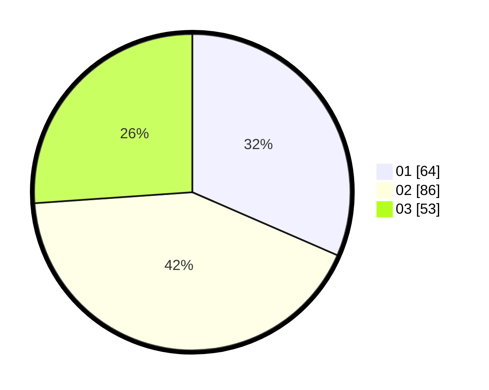

# Hasil

Hasil perolehan suara paslon dapat dilihat pada file paslon-01.txt, paslon-02.txt, dan paslon-03.txt.

Jika tidak ada, artinya data tersebut belum ada pada SIREKAP.

## Perolehan Suara

 * Paslon 01: **64**.
 * Paslon 02: **86**.
 * Paslon 03: **53**.

## Foto C Plano

https://sirekap-obj-formc.kpu.go.id/2957/pemilu/ppwp/31/71/01/10/05/3171011005006-20240214-224720--1e83bc95-337b-4874-a94e-83402154e90b.jpg

https://sirekap-obj-formc.kpu.go.id/2957/pemilu/ppwp/31/71/01/10/05/3171011005006-20240214-224427--ebf7cd4f-51c8-4f3f-beac-0ed5504d28ec.jpg

https://sirekap-obj-formc.kpu.go.id/2957/pemilu/ppwp/31/71/01/10/05/3171011005006-20240214-224457--1e7bcbe3-de16-4238-b24b-f8e8853f48dc.jpg

## DATA PEMILIH TETAP

Jumlah pemilih dalam DPT: **277**.
 * L: **129**.
 * P: **148**.

## DATA PENGGUNA HAK PILIH

Jumlah pengguna hak pilih dalam DPT: **188**.
 * L: **78**.
 * P: **110**.

Jumlah pengguna hak pilih dalam DPTb: **15**.
 * L: **9**.
 * P: **6**.

Jumlah pengguna hak pilih dalam DPK: **3**.
 * L: **2**.
 * P: **1**.

Jumlah pengguna hak pilih: **206**.
 * L: **89**.
 * P: **117**.

## JUMLAH SUARA SAH DAN TIDAK SAH

JUMLAH SELURUH SUARA SAH: **203**.

JUMLAH SUARA TIDAK SAH: **3**.

JUMLAH SELURUH SUARA SAH DAN SUARA TIDAK SAH: **206**.
