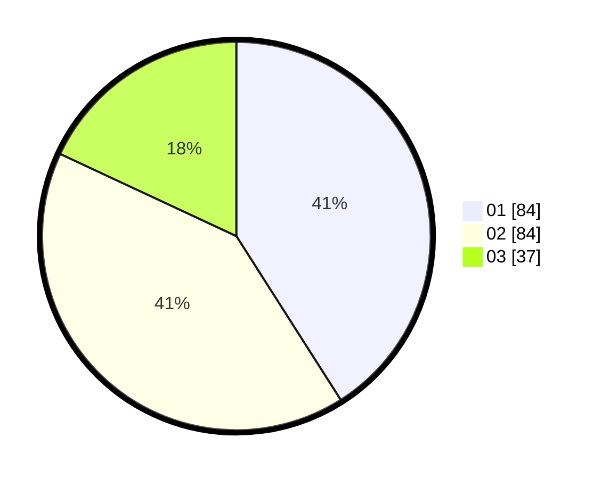

# Hasil

Hasil perolehan suara paslon dapat dilihat pada file paslon-01.txt, paslon-02.txt, dan paslon-03.txt.

Jika tidak ada, artinya data tersebut belum ada pada SIREKAP.

## Perolehan Suara

 * Paslon 01: **84**.
 * Paslon 02: **84**.
 * Paslon 03: **37**.

## Foto C Plano

https://sirekap-obj-formc.kpu.go.id/4f2a/pemilu/ppwp/31/71/01/10/05/3171011005011-20240215-002131--a65e0a1e-2016-43b1-9718-09616c990d2f.jpg

https://sirekap-obj-formc.kpu.go.id/4f2a/pemilu/ppwp/31/71/01/10/05/3171011005011-20240215-002304--164bd841-293d-443d-90c9-2d85bc3e3c5c.jpg

https://sirekap-obj-formc.kpu.go.id/4f2a/pemilu/ppwp/31/71/01/10/05/3171011005011-20240215-002641--80814b1a-d898-406c-aef7-5e7ace58bb5f.jpg

## DATA PEMILIH TETAP

Jumlah pemilih dalam DPT: **265**.
 * L: **128**.
 * P: **137**.

## DATA PENGGUNA HAK PILIH

Jumlah pengguna hak pilih dalam DPT: **195**.
 * L: **94**.
 * P: **100**.

Jumlah pengguna hak pilih dalam DPTb: **11**.
 * L: **5**.
 * P: **6**.

Jumlah pengguna hak pilih dalam DPK: **2**.
 * L: **0**.
 * P: **2**.

Jumlah pengguna hak pilih: **207**.
 * L: **99**.
 * P: **108**.

## JUMLAH SUARA SAH DAN TIDAK SAH

JUMLAH SELURUH SUARA SAH: **205**.

JUMLAH SUARA TIDAK SAH: **2**.

JUMLAH SELURUH SUARA SAH DAN SUARA TIDAK SAH: **207**.
