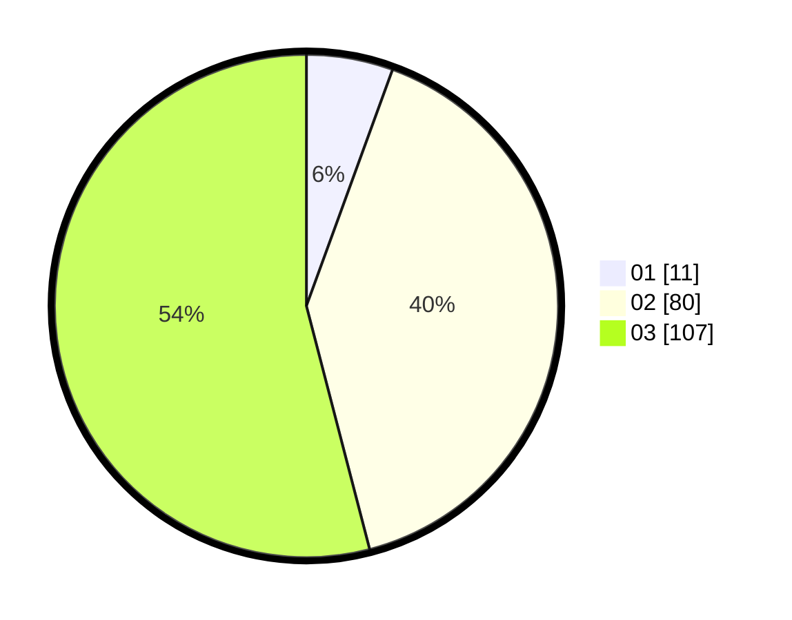

# Hasil

Hasil perolehan suara paslon dapat dilihat pada file paslon-01.txt, paslon-02.txt, dan paslon-03.txt.

Jika tidak ada, artinya data tersebut belum ada pada SIREKAP.

## Perolehan Suara

 * Paslon 01: **11**.
 * Paslon 02: **80**.
 * Paslon 03: **107**.

## Foto C Plano

https://sirekap-obj-formc.kpu.go.id/652b/pemilu/ppwp/31/71/01/10/05/3171011005012-20240214-225031--6e93fdf9-6515-461e-87cd-9631e08e9d1c.jpg

https://sirekap-obj-formc.kpu.go.id/652b/pemilu/ppwp/31/71/01/10/05/3171011005012-20240214-225257--42ec1da3-3760-44dd-a012-a3c18711701c.jpg

https://sirekap-obj-formc.kpu.go.id/652b/pemilu/ppwp/31/71/01/10/05/3171011005012-20240214-225507--a47bbca9-95b7-40d9-a151-c85052c21073.jpg

## DATA PEMILIH TETAP

Jumlah pemilih dalam DPT: **257**.
 * L: **128**.
 * P: **129**.

## DATA PENGGUNA HAK PILIH

Jumlah pengguna hak pilih dalam DPT: **175**.
 * L: **87**.
 * P: **88**.

Jumlah pengguna hak pilih dalam DPTb: **25**.
 * L: **10**.
 * P: **15**.

Jumlah pengguna hak pilih dalam DPK: **0**.
 * L: **0**.
 * P: **0**.

Jumlah pengguna hak pilih: **200**.
 * L: **97**.
 * P: **103**.

## JUMLAH SUARA SAH DAN TIDAK SAH

JUMLAH SELURUH SUARA SAH: **198**.

JUMLAH SUARA TIDAK SAH: **2**.

JUMLAH SELURUH SUARA SAH DAN SUARA TIDAK SAH: **200**.
