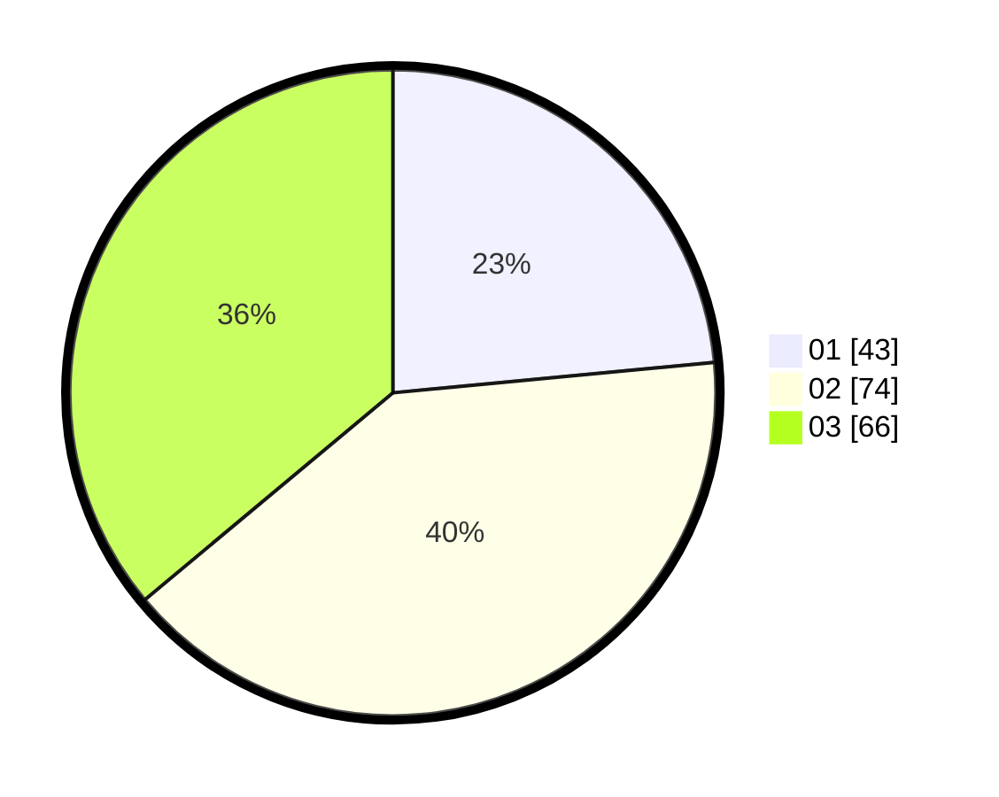

# Hasil

Hasil perolehan suara paslon dapat dilihat pada file paslon-01.txt, paslon-02.txt, dan paslon-03.txt.

Jika tidak ada, artinya data tersebut belum ada pada SIREKAP.

## Perolehan Suara

 * Paslon 01: **43**.
 * Paslon 02: **74**.
 * Paslon 03: **66**.

## Foto C Plano

https://sirekap-obj-formc.kpu.go.id/7b64/pemilu/ppwp/31/71/01/10/05/3171011005013-20240216-054431--50e02272-ad7c-4dd7-a929-84a88afc9f6c.jpg

https://sirekap-obj-formc.kpu.go.id/7b64/pemilu/ppwp/31/71/01/10/05/3171011005013-20240214-185853--3f1037fb-4bdf-47d7-b966-2a85cc032300.jpg

https://sirekap-obj-formc.kpu.go.id/7b64/pemilu/ppwp/31/71/01/10/05/3171011005013-20240214-184625--0ebbe23c-cd78-4549-9576-1e033d5673c4.jpg

## DATA PEMILIH TETAP

Jumlah pemilih dalam DPT: **244**.
 * L: **114**.
 * P: **130**.

## DATA PENGGUNA HAK PILIH

Jumlah pengguna hak pilih dalam DPT: **244**.
 * L: **114**.
 * P: **130**.

Jumlah pengguna hak pilih dalam DPTb: **21**.
 * L: **4**.
 * P: **17**.

Jumlah pengguna hak pilih dalam DPK: **1**.
 * L: **0**.
 * P: **1**.

Jumlah pengguna hak pilih: **266**.
 * L: **118**.
 * P: **148**.

## JUMLAH SUARA SAH DAN TIDAK SAH

JUMLAH SELURUH SUARA SAH: **183**.

JUMLAH SUARA TIDAK SAH: **2**.

JUMLAH SELURUH SUARA SAH DAN SUARA TIDAK SAH: **185**.
