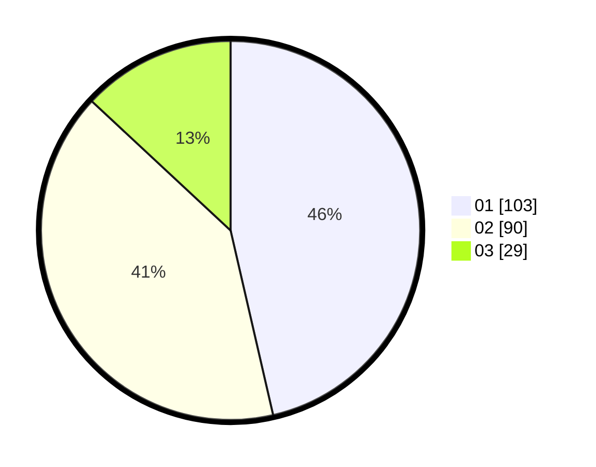

# Hasil

Hasil perolehan suara paslon dapat dilihat pada file paslon-01.txt, paslon-02.txt, dan paslon-03.txt.

Jika tidak ada, artinya data tersebut belum ada pada SIREKAP.

## Perolehan Suara

 * Paslon 01: **103**.
 * Paslon 02: **90**.
 * Paslon 03: **29**.

## Foto C Plano

https://sirekap-obj-formc.kpu.go.id/0d30/pemilu/ppwp/31/71/01/10/05/3171011005014-20240215-011334--71b74950-5990-46ee-9d42-3c624836cbf8.jpg

https://sirekap-obj-formc.kpu.go.id/0d30/pemilu/ppwp/31/71/01/10/05/3171011005014-20240214-204728--8efcf63a-3211-4cfe-854c-bd2689f25514.jpg

https://sirekap-obj-formc.kpu.go.id/0d30/pemilu/ppwp/31/71/01/10/05/3171011005014-20240215-011459--5a199592-4be7-4709-98f3-5ae332c5cae0.jpg

## DATA PEMILIH TETAP

Jumlah pemilih dalam DPT: **254**.
 * L: **133**.
 * P: **121**.

## DATA PENGGUNA HAK PILIH

Jumlah pengguna hak pilih dalam DPT: **206**.
 * L: **106**.
 * P: **100**.

Jumlah pengguna hak pilih dalam DPTb: **17**.
 * L: **13**.
 * P: **4**.

Jumlah pengguna hak pilih dalam DPK: **1**.
 * L: **0**.
 * P: **1**.

Jumlah pengguna hak pilih: **224**.
 * L: **119**.
 * P: **105**.

## JUMLAH SUARA SAH DAN TIDAK SAH

JUMLAH SELURUH SUARA SAH: **222**.

JUMLAH SUARA TIDAK SAH: **2**.

JUMLAH SELURUH SUARA SAH DAN SUARA TIDAK SAH: **224**.
