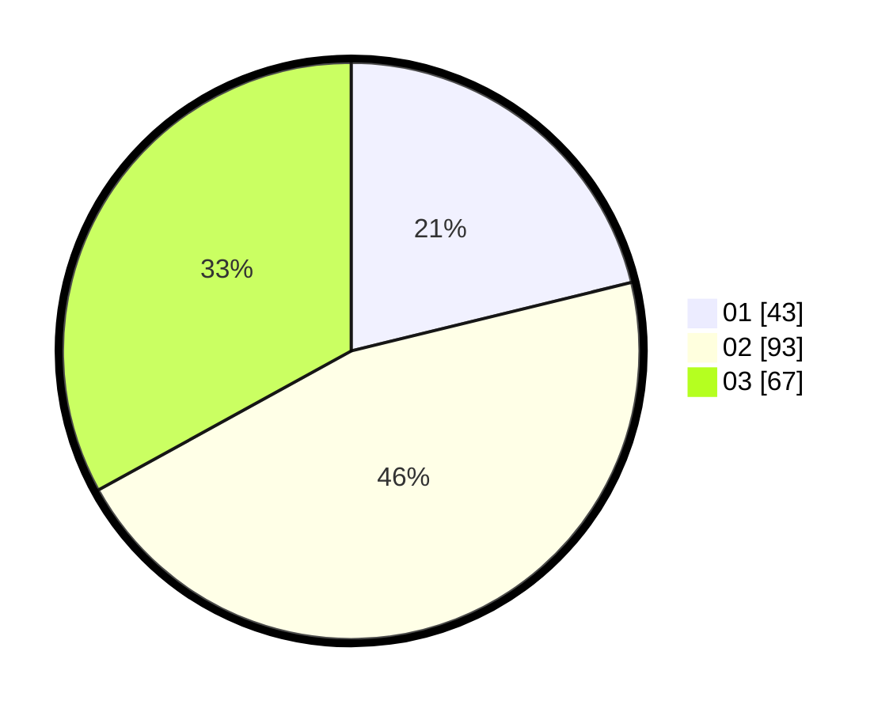

# Hasil

Hasil perolehan suara paslon dapat dilihat pada file paslon-01.txt, paslon-02.txt, dan paslon-03.txt.

Jika tidak ada, artinya data tersebut belum ada pada SIREKAP.

## Perolehan Suara

 * Paslon 01: **43**.
 * Paslon 02: **93**.
 * Paslon 03: **67**.

## Foto C Plano

https://sirekap-obj-formc.kpu.go.id/a7a3/pemilu/ppwp/31/71/01/10/05/3171011005018-20240216-004415--85d0ec2f-6ff1-4663-bed2-25959895764f.jpg

https://sirekap-obj-formc.kpu.go.id/a7a3/pemilu/ppwp/31/71/01/10/05/3171011005018-20240216-004417--7da2ed48-85ce-4ca2-aab3-3d90bccbbf25.jpg

https://sirekap-obj-formc.kpu.go.id/a7a3/pemilu/ppwp/31/71/01/10/05/3171011005018-20240216-004416--d7aeae14-1630-4af0-87bb-4566ac47353b.jpg

## DATA PEMILIH TETAP

Jumlah pemilih dalam DPT: **241**.
 * L: **113**.
 * P: **128**.

## DATA PENGGUNA HAK PILIH

Jumlah pengguna hak pilih dalam DPT: **184**.
 * L: **86**.
 * P: **98**.

Jumlah pengguna hak pilih dalam DPTb: **21**.
 * L: **6**.
 * P: **15**.

Jumlah pengguna hak pilih dalam DPK: **1**.
 * L: **1**.
 * P: **0**.

Jumlah pengguna hak pilih: **206**.
 * L: **93**.
 * P: **113**.

## JUMLAH SUARA SAH DAN TIDAK SAH

JUMLAH SELURUH SUARA SAH: **203**.

JUMLAH SUARA TIDAK SAH: **3**.

JUMLAH SELURUH SUARA SAH DAN SUARA TIDAK SAH: **206**.
