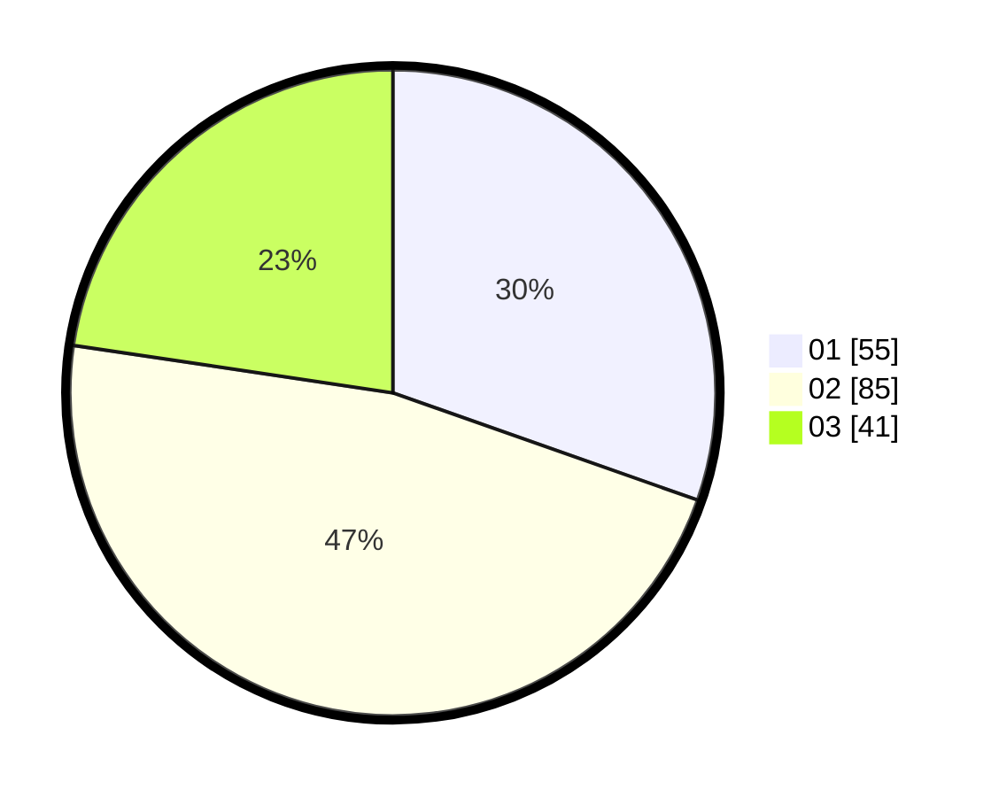

# Hasil

Hasil perolehan suara paslon dapat dilihat pada file paslon-01.txt, paslon-02.txt, dan paslon-03.txt.

Jika tidak ada, artinya data tersebut belum ada pada SIREKAP.

## Perolehan Suara

 * Paslon 01: **55**.
 * Paslon 02: **85**.
 * Paslon 03: **41**.

## Foto C Plano

https://sirekap-obj-formc.kpu.go.id/9893/pemilu/ppwp/31/71/01/10/05/3171011005019-20240214-155228--5caa69f2-29aa-446f-8c02-419ef8b8fcd4.jpg

https://sirekap-obj-formc.kpu.go.id/9893/pemilu/ppwp/31/71/01/10/05/3171011005019-20240214-155210--8cdb7c37-7cf2-44da-a986-3b34c2f0bad8.jpg

https://sirekap-obj-formc.kpu.go.id/9893/pemilu/ppwp/31/71/01/10/05/3171011005019-20240214-155017--8a41d562-782d-478e-b858-0052e906c37d.jpg

## DATA PEMILIH TETAP

Jumlah pemilih dalam DPT: **264**.
 * L: **137**.
 * P: **127**.

## DATA PENGGUNA HAK PILIH

Jumlah pengguna hak pilih dalam DPT: **164**.
 * L: **85**.
 * P: **79**.

Jumlah pengguna hak pilih dalam DPTb: **15**.
 * L: **1**.
 * P: **14**.

Jumlah pengguna hak pilih dalam DPK: **2**.
 * L: **1**.
 * P: **1**.

Jumlah pengguna hak pilih: **181**.
 * L: **87**.
 * P: **94**.

## JUMLAH SUARA SAH DAN TIDAK SAH

JUMLAH SELURUH SUARA SAH: **181**.

JUMLAH SUARA TIDAK SAH: **0**.

JUMLAH SELURUH SUARA SAH DAN SUARA TIDAK SAH: **181**.
