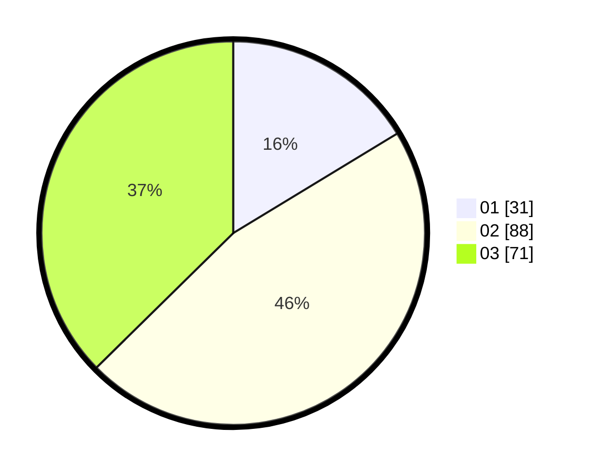

# Hasil

Hasil perolehan suara paslon dapat dilihat pada file paslon-01.txt, paslon-02.txt, dan paslon-03.txt.

Jika tidak ada, artinya data tersebut belum ada pada SIREKAP.

## Perolehan Suara

 * Paslon 01: **31**.
 * Paslon 02: **88**.
 * Paslon 03: **71**.

## Foto C Plano

https://sirekap-obj-formc.kpu.go.id/6e1c/pemilu/ppwp/31/71/01/10/05/3171011005020-20240214-231827--0b55bee8-bb20-4c41-9b1c-4dbc07c706cf.jpg

https://sirekap-obj-formc.kpu.go.id/6e1c/pemilu/ppwp/31/71/01/10/05/3171011005020-20240214-232211--2906b13c-6707-40df-8b53-c0a9f0319802.jpg

https://sirekap-obj-formc.kpu.go.id/6e1c/pemilu/ppwp/31/71/01/10/05/3171011005020-20240214-232335--1b7502fe-758a-48f2-aaec-e37c7594e92e.jpg

## DATA PEMILIH TETAP

Jumlah pemilih dalam DPT: **237**.
 * L: **92**.
 * P: **145**.

## DATA PENGGUNA HAK PILIH

Jumlah pengguna hak pilih dalam DPT: **156**.
 * L: **62**.
 * P: **94**.

Jumlah pengguna hak pilih dalam DPTb: **33**.
 * L: **8**.
 * P: **25**.

Jumlah pengguna hak pilih dalam DPK: **3**.
 * L: **0**.
 * P: **3**.

Jumlah pengguna hak pilih: **192**.
 * L: **70**.
 * P: **122**.

## JUMLAH SUARA SAH DAN TIDAK SAH

JUMLAH SELURUH SUARA SAH: **190**.

JUMLAH SUARA TIDAK SAH: **2**.

JUMLAH SELURUH SUARA SAH DAN SUARA TIDAK SAH: **192**.
