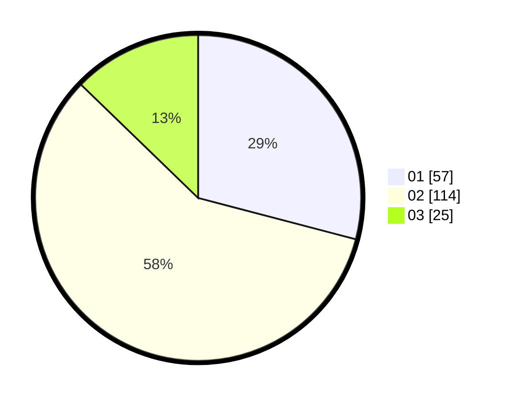

# Hasil

Hasil perolehan suara paslon dapat dilihat pada file paslon-01.txt, paslon-02.txt, dan paslon-03.txt.

Jika tidak ada, artinya data tersebut belum ada pada SIREKAP.

## Perolehan Suara

 * Paslon 01: **57**.
 * Paslon 02: **114**.
 * Paslon 03: **25**.

## Foto C Plano

https://sirekap-obj-formc.kpu.go.id/df10/pemilu/ppwp/31/71/01/10/05/3171011005023-20240214-212912--b4bcf99f-d782-4f07-b66c-3437342c34af.jpg

https://sirekap-obj-formc.kpu.go.id/df10/pemilu/ppwp/31/71/01/10/05/3171011005023-20240214-213100--de60b32f-ddfe-4389-baea-bb8f7ae36d90.jpg

https://sirekap-obj-formc.kpu.go.id/df10/pemilu/ppwp/31/71/01/10/05/3171011005023-20240214-213209--9d08ab9e-21b1-4ea5-9572-c74abef1434e.jpg

## DATA PEMILIH TETAP

Jumlah pemilih dalam DPT: **170**.
 * L: **91**.
 * P: **79**.

## DATA PENGGUNA HAK PILIH

Jumlah pengguna hak pilih dalam DPT: **170**.
 * L: **91**.
 * P: **79**.

Jumlah pengguna hak pilih dalam DPTb: **15**.
 * L: **5**.
 * P: **10**.

Jumlah pengguna hak pilih dalam DPK: **6**.
 * L: **2**.
 * P: **4**.

Jumlah pengguna hak pilih: **21**.
 * L: **98**.
 * P: **93**.

## JUMLAH SUARA SAH DAN TIDAK SAH

JUMLAH SELURUH SUARA SAH: **196**.

JUMLAH SUARA TIDAK SAH: **6**.

JUMLAH SELURUH SUARA SAH DAN SUARA TIDAK SAH: **202**.
