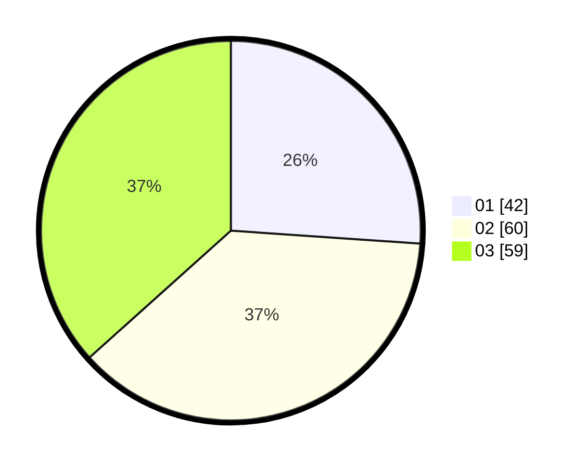

# Hasil

Hasil perolehan suara paslon dapat dilihat pada file paslon-01.txt, paslon-02.txt, dan paslon-03.txt.

Jika tidak ada, artinya data tersebut belum ada pada SIREKAP.

## Perolehan Suara

 * Paslon 01: **42**.
 * Paslon 02: **60**.
 * Paslon 03: **59**.

## Foto C Plano

https://sirekap-obj-formc.kpu.go.id/4f51/pemilu/ppwp/31/71/01/10/05/3171011005024-20240216-194126--61722644-376a-480a-a112-9155ac5dab60.jpg

https://sirekap-obj-formc.kpu.go.id/4f51/pemilu/ppwp/31/71/01/10/05/3171011005024-20240216-194127--7edd2126-5c30-4a5b-aea2-bf633adee311.jpg

https://sirekap-obj-formc.kpu.go.id/4f51/pemilu/ppwp/31/71/01/10/05/3171011005024-20240216-194126--5f366b36-aafb-4718-afd7-c7548067d890.jpg

## DATA PEMILIH TETAP

Jumlah pemilih dalam DPT: **218**.
 * L: **111**.
 * P: **107**.

## DATA PENGGUNA HAK PILIH

Jumlah pengguna hak pilih dalam DPT: **154**.
 * L: **77**.
 * P: **77**.

Jumlah pengguna hak pilih dalam DPTb: **10**.
 * L: **4**.
 * P: **6**.

Jumlah pengguna hak pilih dalam DPK: **0**.
 * L: **0**.
 * P: **0**.

Jumlah pengguna hak pilih: **164**.
 * L: **81**.
 * P: **83**.

## JUMLAH SUARA SAH DAN TIDAK SAH

JUMLAH SELURUH SUARA SAH: **161**.

JUMLAH SUARA TIDAK SAH: **3**.

JUMLAH SELURUH SUARA SAH DAN SUARA TIDAK SAH: **164**.
