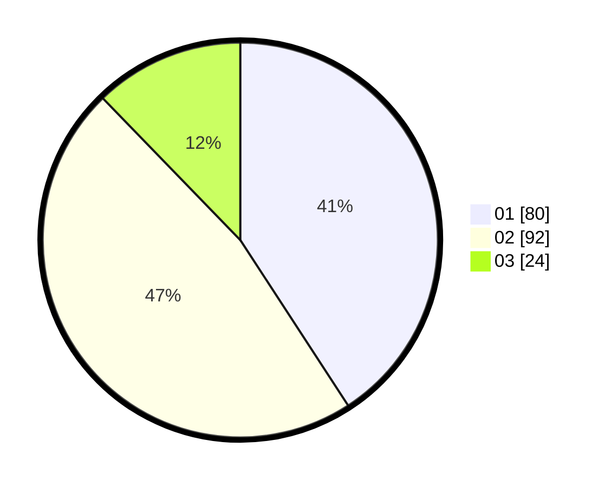

# Hasil

Hasil perolehan suara paslon dapat dilihat pada file paslon-01.txt, paslon-02.txt, dan paslon-03.txt.

Jika tidak ada, artinya data tersebut belum ada pada SIREKAP.

## Perolehan Suara

 * Paslon 01: **80**.
 * Paslon 02: **92**.
 * Paslon 03: **24**.

## Foto C Plano

https://sirekap-obj-formc.kpu.go.id/98fd/pemilu/ppwp/31/71/01/10/05/3171011005025-20240216-195044--393b7c84-e416-4323-b7ff-d3a3b829698b.jpg

https://sirekap-obj-formc.kpu.go.id/98fd/pemilu/ppwp/31/71/01/10/05/3171011005025-20240216-195046--dc313e8e-8987-46a3-93e7-4c6e3bd13f5e.jpg

https://sirekap-obj-formc.kpu.go.id/98fd/pemilu/ppwp/31/71/01/10/05/3171011005025-20240216-195045--43fdfd72-4a20-4ed4-9f70-b04100373af1.jpg

## DATA PEMILIH TETAP

Jumlah pemilih dalam DPT: **252**.
 * L: **133**.
 * P: **119**.

## DATA PENGGUNA HAK PILIH

Jumlah pengguna hak pilih dalam DPT: **183**.
 * L: **96**.
 * P: **87**.

Jumlah pengguna hak pilih dalam DPTb: **17**.
 * L: **9**.
 * P: **8**.

Jumlah pengguna hak pilih dalam DPK: **1**.
 * L: **0**.
 * P: **1**.

Jumlah pengguna hak pilih: **201**.
 * L: **105**.
 * P: **96**.

## JUMLAH SUARA SAH DAN TIDAK SAH

JUMLAH SELURUH SUARA SAH: **196**.

JUMLAH SUARA TIDAK SAH: **5**.

JUMLAH SELURUH SUARA SAH DAN SUARA TIDAK SAH: **201**.
