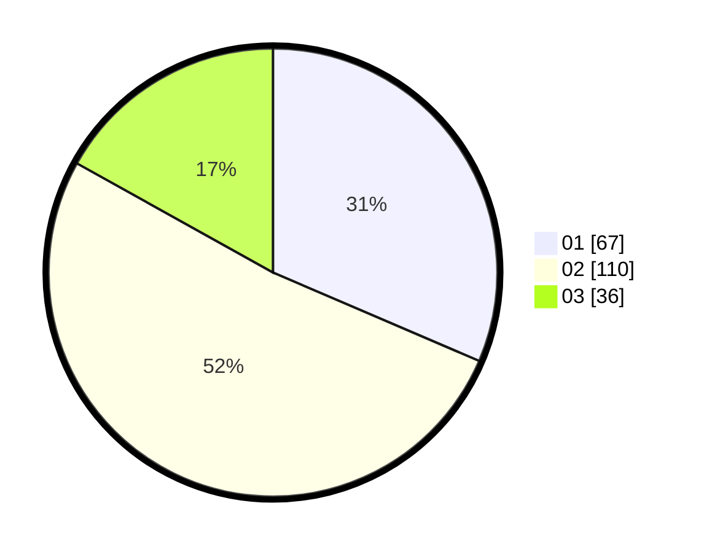

# Hasil

Hasil perolehan suara paslon dapat dilihat pada file paslon-01.txt, paslon-02.txt, dan paslon-03.txt.

Jika tidak ada, artinya data tersebut belum ada pada SIREKAP.

## Perolehan Suara

 * Paslon 01: **67**.
 * Paslon 02: **110**.
 * Paslon 03: **36**.

## Foto C Plano

https://sirekap-obj-formc.kpu.go.id/41c9/pemilu/ppwp/31/71/01/10/05/3171011005026-20240215-015753--5850041e-f5f7-4114-bc94-9452b364bb44.jpg

https://sirekap-obj-formc.kpu.go.id/41c9/pemilu/ppwp/31/71/01/10/05/3171011005026-20240215-015815--1c44e4cb-cd9c-4d99-9022-8918c225edae.jpg

https://sirekap-obj-formc.kpu.go.id/41c9/pemilu/ppwp/31/71/01/10/05/3171011005026-20240215-015805--931c3496-715b-45e9-94e4-dbba26a27d16.jpg

## DATA PEMILIH TETAP

Jumlah pemilih dalam DPT: **267**.
 * L: **140**.
 * P: **127**.

## DATA PENGGUNA HAK PILIH

Jumlah pengguna hak pilih dalam DPT: **188**.
 * L: **95**.
 * P: **93**.

Jumlah pengguna hak pilih dalam DPTb: **22**.
 * L: **9**.
 * P: **13**.

Jumlah pengguna hak pilih dalam DPK: **3**.
 * L: **2**.
 * P: **1**.

Jumlah pengguna hak pilih: **213**.
 * L: **106**.
 * P: **107**.

## JUMLAH SUARA SAH DAN TIDAK SAH

JUMLAH SELURUH SUARA SAH: **213**.

JUMLAH SUARA TIDAK SAH: **0**.

JUMLAH SELURUH SUARA SAH DAN SUARA TIDAK SAH: **213**.
