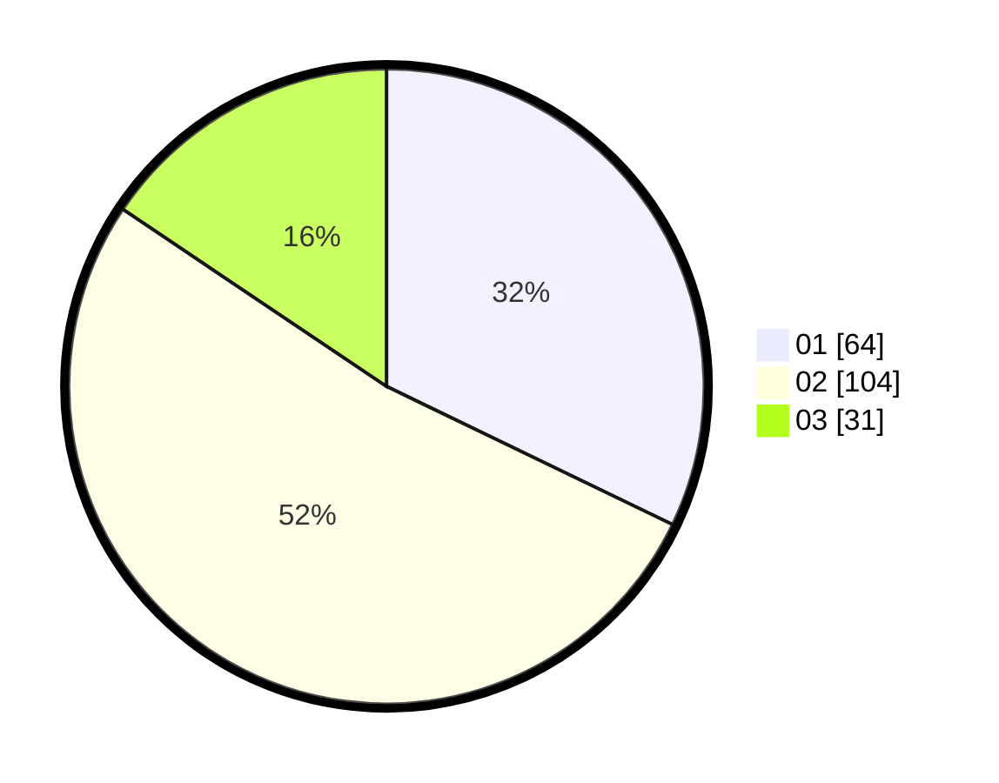

# Hasil

Hasil perolehan suara paslon dapat dilihat pada file paslon-01.txt, paslon-02.txt, dan paslon-03.txt.

Jika tidak ada, artinya data tersebut belum ada pada SIREKAP.

## Perolehan Suara

 * Paslon 01: **64**.
 * Paslon 02: **104**.
 * Paslon 03: **31**.

## Foto C Plano

https://sirekap-obj-formc.kpu.go.id/cd64/pemilu/ppwp/31/71/01/10/05/3171011005027-20240215-222140--546821e4-8387-4fa7-b733-49e8d449c63d.jpg

https://sirekap-obj-formc.kpu.go.id/cd64/pemilu/ppwp/31/71/01/10/05/3171011005027-20240215-222142--7ec8a4a4-a2c5-40ed-a53d-c483c5011de7.jpg

https://sirekap-obj-formc.kpu.go.id/cd64/pemilu/ppwp/31/71/01/10/05/3171011005027-20240215-222141--b414f123-075a-41cf-a64c-80cf71e0cd04.jpg

## DATA PEMILIH TETAP

Jumlah pemilih dalam DPT: **259**.
 * L: **135**.
 * P: **124**.

## DATA PENGGUNA HAK PILIH

Jumlah pengguna hak pilih dalam DPT: **192**.
 * L: **103**.
 * P: **89**.

Jumlah pengguna hak pilih dalam DPTb: **11**.
 * L: **6**.
 * P: **5**.

Jumlah pengguna hak pilih dalam DPK: **0**.
 * L: **0**.
 * P: **0**.

Jumlah pengguna hak pilih: **203**.
 * L: **109**.
 * P: **94**.

## JUMLAH SUARA SAH DAN TIDAK SAH

JUMLAH SELURUH SUARA SAH: **199**.

JUMLAH SUARA TIDAK SAH: **5**.

JUMLAH SELURUH SUARA SAH DAN SUARA TIDAK SAH: **204**.
