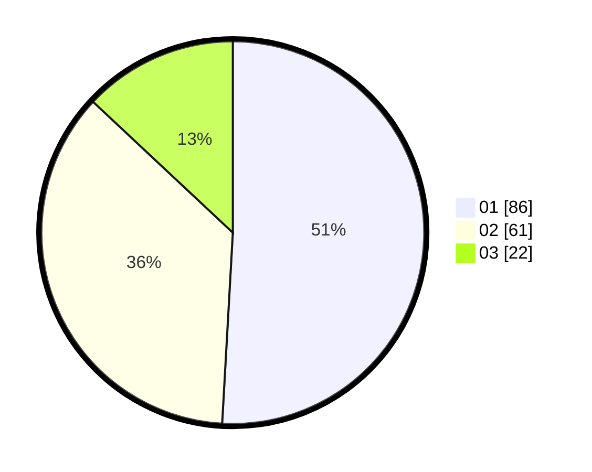

# Hasil

Hasil perolehan suara paslon dapat dilihat pada file paslon-01.txt, paslon-02.txt, dan paslon-03.txt.

Jika tidak ada, artinya data tersebut belum ada pada SIREKAP.

## Perolehan Suara

 * Paslon 01: **86**.
 * Paslon 02: **61**.
 * Paslon 03: **22**.

## Foto C Plano

https://sirekap-obj-formc.kpu.go.id/9f04/pemilu/ppwp/31/71/01/10/05/3171011005030-20240216-143513--df6d54cf-d0c4-4831-b9e4-f1f507f5f81b.jpg

https://sirekap-obj-formc.kpu.go.id/9f04/pemilu/ppwp/31/71/01/10/05/3171011005030-20240216-143514--9cc8198f-f6e8-48e6-bb9f-6489c62bff16.jpg

https://sirekap-obj-formc.kpu.go.id/9f04/pemilu/ppwp/31/71/01/10/05/3171011005030-20240216-143513--9daa02b1-493b-4af7-a3c5-e731e6550267.jpg

## DATA PEMILIH TETAP

Jumlah pemilih dalam DPT: **228**.
 * L: **124**.
 * P: **104**.

## DATA PENGGUNA HAK PILIH

Jumlah pengguna hak pilih dalam DPT: **156**.
 * L: **84**.
 * P: **72**.

Jumlah pengguna hak pilih dalam DPTb: **12**.
 * L: **8**.
 * P: **4**.

Jumlah pengguna hak pilih dalam DPK: **1**.
 * L: **1**.
 * P: **0**.

Jumlah pengguna hak pilih: **169**.
 * L: **93**.
 * P: **76**.

## JUMLAH SUARA SAH DAN TIDAK SAH

JUMLAH SELURUH SUARA SAH: **169**.

JUMLAH SUARA TIDAK SAH: **0**.

JUMLAH SELURUH SUARA SAH DAN SUARA TIDAK SAH: **169**.
