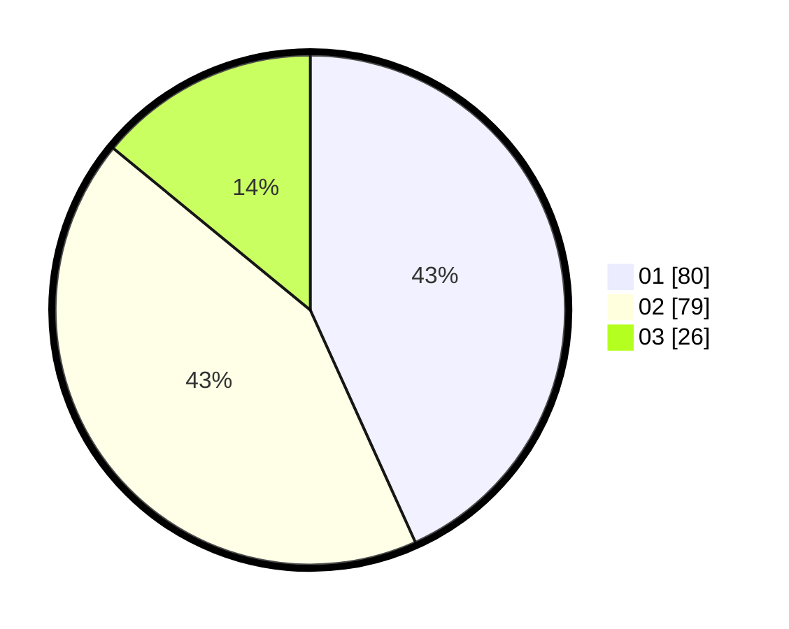

# Hasil

Hasil perolehan suara paslon dapat dilihat pada file paslon-01.txt, paslon-02.txt, dan paslon-03.txt.

Jika tidak ada, artinya data tersebut belum ada pada SIREKAP.

## Perolehan Suara

 * Paslon 01: **80**.
 * Paslon 02: **79**.
 * Paslon 03: **26**.

## Foto C Plano

https://sirekap-obj-formc.kpu.go.id/1ede/pemilu/ppwp/31/71/01/10/05/3171011005031-20240215-000939--b47306ce-0b5b-435c-9528-dfe76cdf9fe0.jpg

https://sirekap-obj-formc.kpu.go.id/1ede/pemilu/ppwp/31/71/01/10/05/3171011005031-20240215-001126--31297164-d7d3-4438-a550-b91a4b196cf7.jpg

https://sirekap-obj-formc.kpu.go.id/1ede/pemilu/ppwp/31/71/01/10/05/3171011005031-20240215-001310--bf997d85-672f-4674-af94-ed71721f5e87.jpg

## DATA PEMILIH TETAP

Jumlah pemilih dalam DPT: **230**.
 * L: **110**.
 * P: **120**.

## DATA PENGGUNA HAK PILIH

Jumlah pengguna hak pilih dalam DPT: **176**.
 * L: **83**.
 * P: **93**.

Jumlah pengguna hak pilih dalam DPTb: **12**.
 * L: **7**.
 * P: **5**.

Jumlah pengguna hak pilih dalam DPK: **0**.
 * L: **0**.
 * P: **0**.

Jumlah pengguna hak pilih: **188**.
 * L: **90**.
 * P: **98**.

## JUMLAH SUARA SAH DAN TIDAK SAH

JUMLAH SELURUH SUARA SAH: **185**.

JUMLAH SUARA TIDAK SAH: **3**.

JUMLAH SELURUH SUARA SAH DAN SUARA TIDAK SAH: **188**.
