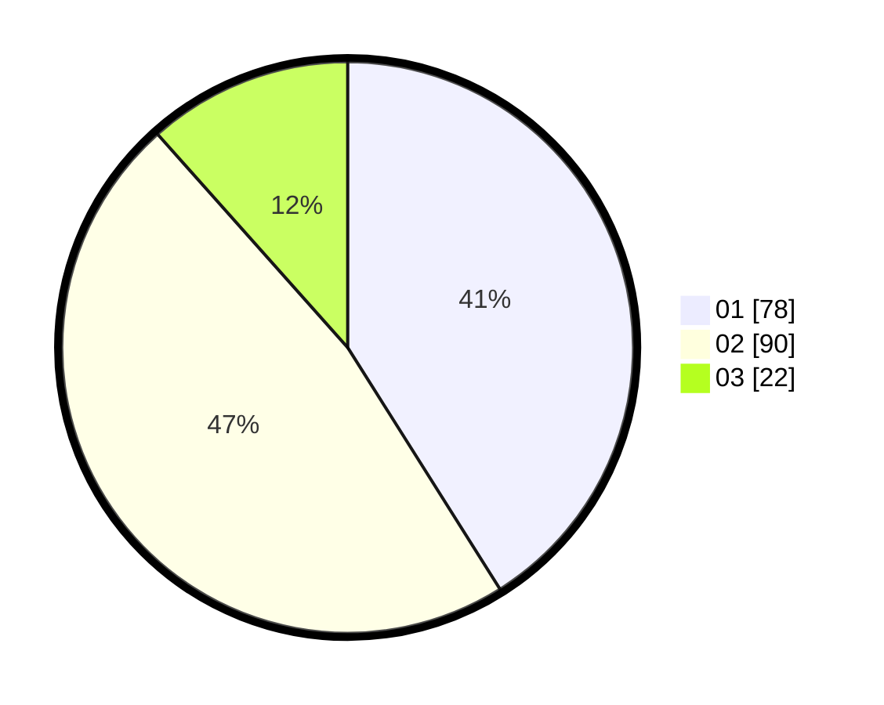

# Hasil

Hasil perolehan suara paslon dapat dilihat pada file paslon-01.txt, paslon-02.txt, dan paslon-03.txt.

Jika tidak ada, artinya data tersebut belum ada pada SIREKAP.

## Perolehan Suara

 * Paslon 01: **78**.
 * Paslon 02: **90**.
 * Paslon 03: **22**.

## Foto C Plano

https://sirekap-obj-formc.kpu.go.id/3794/pemilu/ppwp/31/71/01/10/05/3171011005033-20240215-004417--73febf28-9ccb-4fe9-ad99-0e4094b86ca6.jpg

https://sirekap-obj-formc.kpu.go.id/3794/pemilu/ppwp/31/71/01/10/05/3171011005033-20240216-142255--b2e9abeb-b418-498c-ad79-f2e32963c958.jpg

https://sirekap-obj-formc.kpu.go.id/3794/pemilu/ppwp/31/71/01/10/05/3171011005033-20240216-142255--2151f35c-e1f5-4d98-b244-a2997877b9d5.jpg

## DATA PEMILIH TETAP

Jumlah pemilih dalam DPT: **244**.
 * L: **131**.
 * P: **113**.

## DATA PENGGUNA HAK PILIH

Jumlah pengguna hak pilih dalam DPT: **193**.
 * L: **100**.
 * P: **93**.

Jumlah pengguna hak pilih dalam DPTb: **4**.
 * L: **2**.
 * P: **2**.

Jumlah pengguna hak pilih dalam DPK: **2**.
 * L: **1**.
 * P: **1**.

Jumlah pengguna hak pilih: **199**.
 * L: **103**.
 * P: **96**.

## JUMLAH SUARA SAH DAN TIDAK SAH

JUMLAH SELURUH SUARA SAH: **190**.

JUMLAH SUARA TIDAK SAH: **9**.

JUMLAH SELURUH SUARA SAH DAN SUARA TIDAK SAH: **199**.
