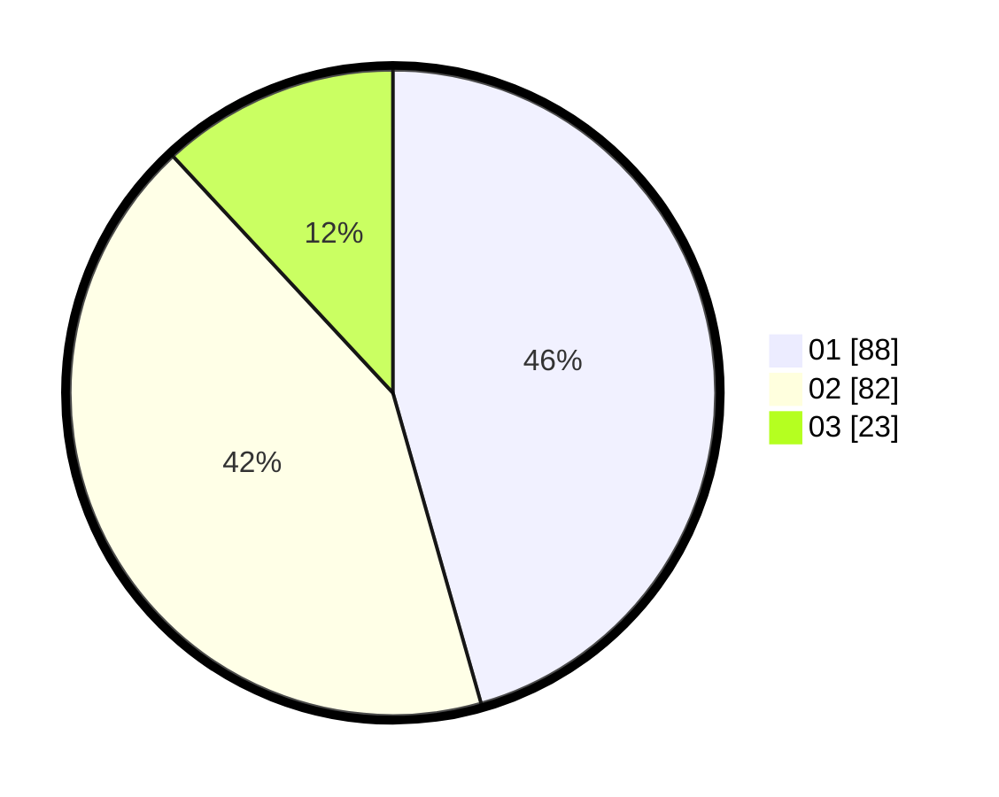

# Hasil

Hasil perolehan suara paslon dapat dilihat pada file paslon-01.txt, paslon-02.txt, dan paslon-03.txt.

Jika tidak ada, artinya data tersebut belum ada pada SIREKAP.

## Perolehan Suara

 * Paslon 01: **88**.
 * Paslon 02: **82**.
 * Paslon 03: **23**.

## Foto C Plano

https://sirekap-obj-formc.kpu.go.id/c389/pemilu/ppwp/31/71/01/10/05/3171011005034-20240215-024139--b41cb1f2-3dac-47f8-86ef-43e8d05e573a.jpg

https://sirekap-obj-formc.kpu.go.id/c389/pemilu/ppwp/31/71/01/10/05/3171011005034-20240215-024353--75bc4aad-0d86-4ea3-84eb-1490b74b5c4f.jpg

https://sirekap-obj-formc.kpu.go.id/c389/pemilu/ppwp/31/71/01/10/05/3171011005034-20240215-024541--f43796f1-0f18-4eb4-ae85-ad053e6a8bfe.jpg

## DATA PEMILIH TETAP

Jumlah pemilih dalam DPT: **230**.
 * L: **116**.
 * P: **114**.

## DATA PENGGUNA HAK PILIH

Jumlah pengguna hak pilih dalam DPT: **180**.
 * L: **88**.
 * P: **92**.

Jumlah pengguna hak pilih dalam DPTb: **7**.
 * L: **3**.
 * P: **4**.

Jumlah pengguna hak pilih dalam DPK: **10**.
 * L: **6**.
 * P: **4**.

Jumlah pengguna hak pilih: **197**.
 * L: **97**.
 * P: **100**.

## JUMLAH SUARA SAH DAN TIDAK SAH

JUMLAH SELURUH SUARA SAH: **193**.

JUMLAH SUARA TIDAK SAH: **4**.

JUMLAH SELURUH SUARA SAH DAN SUARA TIDAK SAH: **197**.
