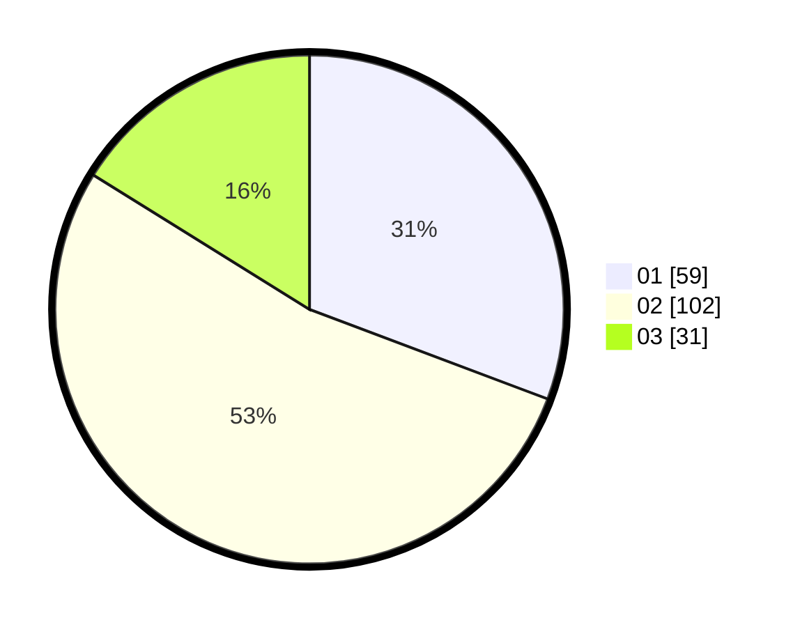

# Hasil

Hasil perolehan suara paslon dapat dilihat pada file paslon-01.txt, paslon-02.txt, dan paslon-03.txt.

Jika tidak ada, artinya data tersebut belum ada pada SIREKAP.

## Perolehan Suara

 * Paslon 01: **59**.
 * Paslon 02: **102**.
 * Paslon 03: **31**.

## Foto C Plano

https://sirekap-obj-formc.kpu.go.id/3f22/pemilu/ppwp/31/71/01/10/05/3171011005035-20240214-193658--cad6e75a-90db-4d4a-b065-3cf5ae7c597f.jpg

https://sirekap-obj-formc.kpu.go.id/3f22/pemilu/ppwp/31/71/01/10/05/3171011005035-20240214-193714--1c66032e-bd15-46aa-b77d-0544ebf98581.jpg

https://sirekap-obj-formc.kpu.go.id/3f22/pemilu/ppwp/31/71/01/10/05/3171011005035-20240214-193732--ed1b910a-4c30-4827-87c8-6bd560f74336.jpg

## DATA PEMILIH TETAP

Jumlah pemilih dalam DPT: **264**.
 * L: **135**.
 * P: **129**.

## DATA PENGGUNA HAK PILIH

Jumlah pengguna hak pilih dalam DPT: **200**.
 * L: **99**.
 * P: **101**.

Jumlah pengguna hak pilih dalam DPTb: **0**.
 * L: **0**.
 * P: **0**.

Jumlah pengguna hak pilih dalam DPK: **0**.
 * L: **0**.
 * P: **0**.

Jumlah pengguna hak pilih: **200**.
 * L: **99**.
 * P: **101**.

## JUMLAH SUARA SAH DAN TIDAK SAH

JUMLAH SELURUH SUARA SAH: **192**.

JUMLAH SUARA TIDAK SAH: **8**.

JUMLAH SELURUH SUARA SAH DAN SUARA TIDAK SAH: **200**.
