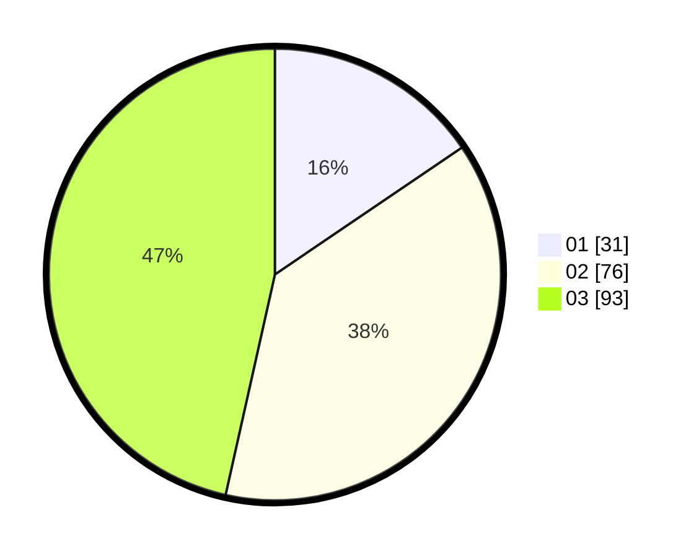

# Hasil

Hasil perolehan suara paslon dapat dilihat pada file paslon-01.txt, paslon-02.txt, dan paslon-03.txt.

Jika tidak ada, artinya data tersebut belum ada pada SIREKAP.

## Perolehan Suara

 * Paslon 01: **31**.
 * Paslon 02: **76**.
 * Paslon 03: **93**.

## Foto C Plano

https://sirekap-obj-formc.kpu.go.id/4a30/pemilu/ppwp/31/71/01/10/06/3171011006001-20240216-142326--1bbfa4df-1a9f-4716-bf40-c25f5b59edda.jpg

https://sirekap-obj-formc.kpu.go.id/4a30/pemilu/ppwp/31/71/01/10/06/3171011006001-20240216-142327--31e10490-3527-4da1-9f61-cbd23cc3ee4d.jpg

https://sirekap-obj-formc.kpu.go.id/4a30/pemilu/ppwp/31/71/01/10/06/3171011006001-20240214-210152--004587a4-8e60-4d06-a71c-33fdbf371b7d.jpg

## DATA PEMILIH TETAP

Jumlah pemilih dalam DPT: **258**.
 * L: **117**.
 * P: **141**.

## DATA PENGGUNA HAK PILIH

Jumlah pengguna hak pilih dalam DPT: **188**.
 * L: **82**.
 * P: **106**.

Jumlah pengguna hak pilih dalam DPTb: **12**.
 * L: **3**.
 * P: **9**.

Jumlah pengguna hak pilih dalam DPK: **1**.
 * L: **0**.
 * P: **1**.

Jumlah pengguna hak pilih: **201**.
 * L: **85**.
 * P: **116**.

## JUMLAH SUARA SAH DAN TIDAK SAH

JUMLAH SELURUH SUARA SAH: **200**.

JUMLAH SUARA TIDAK SAH: **1**.

JUMLAH SELURUH SUARA SAH DAN SUARA TIDAK SAH: **201**.
