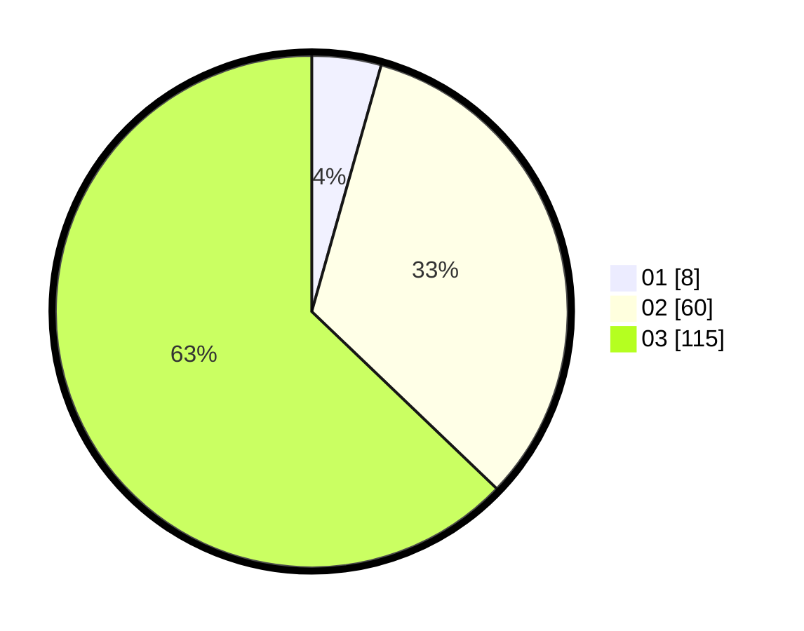

# Hasil

Hasil perolehan suara paslon dapat dilihat pada file paslon-01.txt, paslon-02.txt, dan paslon-03.txt.

Jika tidak ada, artinya data tersebut belum ada pada SIREKAP.

## Perolehan Suara

 * Paslon 01: **8**.
 * Paslon 02: **60**.
 * Paslon 03: **115**.

## Foto C Plano

https://sirekap-obj-formc.kpu.go.id/213c/pemilu/ppwp/31/71/01/10/06/3171011006006-20240216-040704--aa969b46-31ab-4103-bee4-4528c1b44067.jpg

https://sirekap-obj-formc.kpu.go.id/213c/pemilu/ppwp/31/71/01/10/06/3171011006006-20240216-040705--09bd75fb-6534-42ad-aeb9-62b0407818ec.jpg

https://sirekap-obj-formc.kpu.go.id/213c/pemilu/ppwp/31/71/01/10/06/3171011006006-20240216-040704--e01c3224-1928-4cf2-b25b-25880c5a2286.jpg

## DATA PEMILIH TETAP

Jumlah pemilih dalam DPT: **253**.
 * L: **127**.
 * P: **126**.

## DATA PENGGUNA HAK PILIH

Jumlah pengguna hak pilih dalam DPT: **181**.
 * L: **87**.
 * P: **94**.

Jumlah pengguna hak pilih dalam DPTb: **0**.
 * L: **0**.
 * P: **0**.

Jumlah pengguna hak pilih dalam DPK: **3**.
 * L: **1**.
 * P: **2**.

Jumlah pengguna hak pilih: **184**.
 * L: **88**.
 * P: **96**.

## JUMLAH SUARA SAH DAN TIDAK SAH

JUMLAH SELURUH SUARA SAH: **183**.

JUMLAH SUARA TIDAK SAH: **1**.

JUMLAH SELURUH SUARA SAH DAN SUARA TIDAK SAH: **184**.
