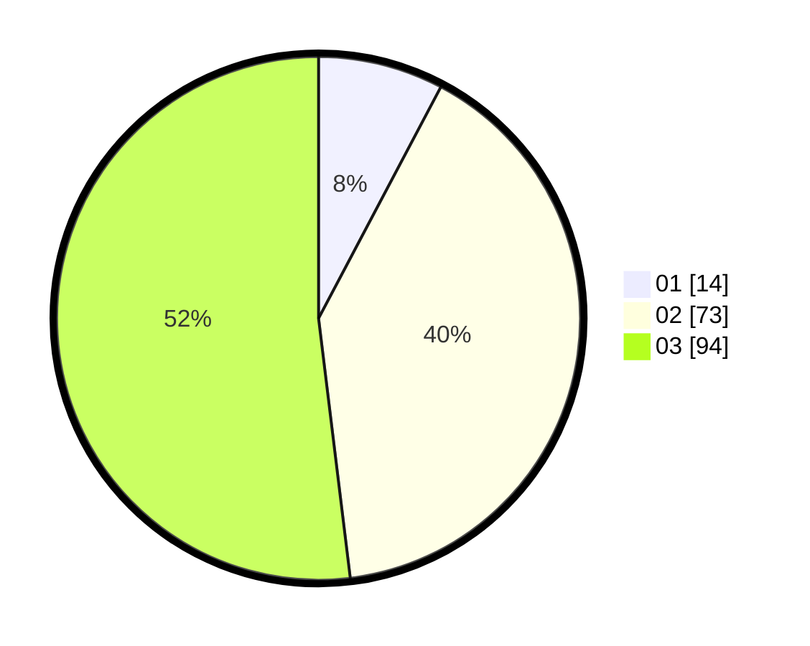

# Hasil

Hasil perolehan suara paslon dapat dilihat pada file paslon-01.txt, paslon-02.txt, dan paslon-03.txt.

Jika tidak ada, artinya data tersebut belum ada pada SIREKAP.

## Perolehan Suara

 * Paslon 01: **14**.
 * Paslon 02: **73**.
 * Paslon 03: **94**.

## Foto C Plano

https://sirekap-obj-formc.kpu.go.id/1e81/pemilu/ppwp/31/71/01/10/06/3171011006010-20240216-010205--a6312e2b-f423-4d08-99b2-470ddaae23f2.jpg

https://sirekap-obj-formc.kpu.go.id/1e81/pemilu/ppwp/31/71/01/10/06/3171011006010-20240216-010208--5a1019bd-d25b-4019-bbf4-648ce807a48a.jpg

https://sirekap-obj-formc.kpu.go.id/1e81/pemilu/ppwp/31/71/01/10/06/3171011006010-20240216-010207--437531ef-6b00-48ad-b94d-95d168bea82c.jpg

## DATA PEMILIH TETAP

Jumlah pemilih dalam DPT: **0**.
 * L: **0**.
 * P: **0**.

## DATA PENGGUNA HAK PILIH

Jumlah pengguna hak pilih dalam DPT: **0**.
 * L: **0**.
 * P: **0**.

Jumlah pengguna hak pilih dalam DPTb: **0**.
 * L: **0**.
 * P: **0**.

Jumlah pengguna hak pilih dalam DPK: **0**.
 * L: **0**.
 * P: **0**.

Jumlah pengguna hak pilih: **0**.
 * L: **0**.
 * P: **0**.

## JUMLAH SUARA SAH DAN TIDAK SAH

JUMLAH SELURUH SUARA SAH: **181**.

JUMLAH SUARA TIDAK SAH: **2**.

JUMLAH SELURUH SUARA SAH DAN SUARA TIDAK SAH: **183**.
