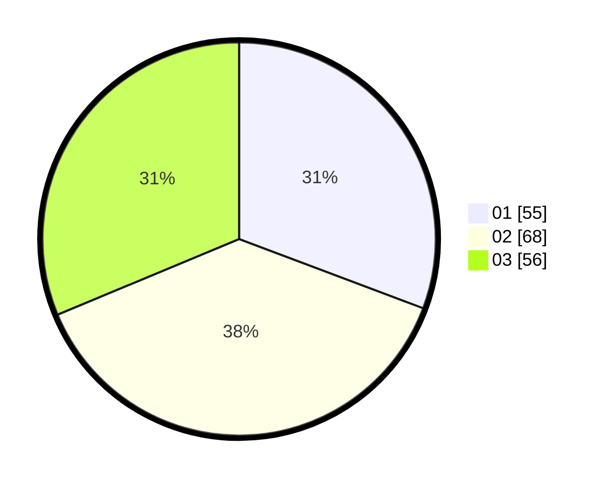

# Hasil

Hasil perolehan suara paslon dapat dilihat pada file paslon-01.txt, paslon-02.txt, dan paslon-03.txt.

Jika tidak ada, artinya data tersebut belum ada pada SIREKAP.

## Perolehan Suara

 * Paslon 01: **55**.
 * Paslon 02: **68**.
 * Paslon 03: **56**.

## Foto C Plano

https://sirekap-obj-formc.kpu.go.id/7da9/pemilu/ppwp/31/71/01/10/06/3171011006013-20240217-104959--64032c34-8bc4-478e-9c5c-4591c1e912d5.jpg

https://sirekap-obj-formc.kpu.go.id/7da9/pemilu/ppwp/31/71/01/10/06/3171011006013-20240217-105000--653ea9f2-f045-4045-9b61-d4462605b1aa.jpg

https://sirekap-obj-formc.kpu.go.id/7da9/pemilu/ppwp/31/71/01/10/06/3171011006013-20240217-104959--f507239f-ca38-4660-9432-0fc247f10441.jpg

## DATA PEMILIH TETAP

Jumlah pemilih dalam DPT: **252**.
 * L: **124**.
 * P: **128**.

## DATA PENGGUNA HAK PILIH

Jumlah pengguna hak pilih dalam DPT: **181**.
 * L: **94**.
 * P: **87**.

Jumlah pengguna hak pilih dalam DPTb: **1**.
 * L: **0**.
 * P: **1**.

Jumlah pengguna hak pilih dalam DPK: **0**.
 * L: **0**.
 * P: **0**.

Jumlah pengguna hak pilih: **182**.
 * L: **94**.
 * P: **88**.

## JUMLAH SUARA SAH DAN TIDAK SAH

JUMLAH SELURUH SUARA SAH: **179**.

JUMLAH SUARA TIDAK SAH: **3**.

JUMLAH SELURUH SUARA SAH DAN SUARA TIDAK SAH: **182**.
