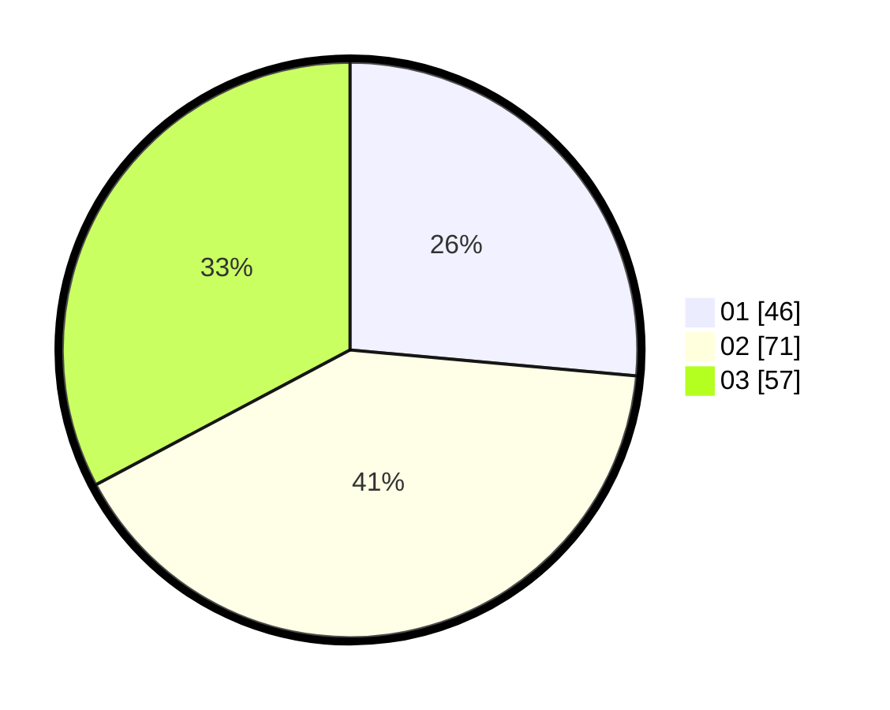

# Hasil

Hasil perolehan suara paslon dapat dilihat pada file paslon-01.txt, paslon-02.txt, dan paslon-03.txt.

Jika tidak ada, artinya data tersebut belum ada pada SIREKAP.

## Perolehan Suara

 * Paslon 01: **46**.
 * Paslon 02: **71**.
 * Paslon 03: **57**.

## Foto C Plano

https://sirekap-obj-formc.kpu.go.id/98e2/pemilu/ppwp/31/71/01/10/06/3171011006014-20240214-201312--2c29c7ed-c052-4882-9808-2b90b119a53f.jpg

https://sirekap-obj-formc.kpu.go.id/98e2/pemilu/ppwp/31/71/01/10/06/3171011006014-20240214-200700--fada30fe-5e82-469d-9d05-cacd7d7fdc0b.jpg

https://sirekap-obj-formc.kpu.go.id/98e2/pemilu/ppwp/31/71/01/10/06/3171011006014-20240214-201438--c2cd9abc-f234-4888-a341-960228f0483c.jpg

## DATA PEMILIH TETAP

Jumlah pemilih dalam DPT: **250**.
 * L: **118**.
 * P: **132**.

## DATA PENGGUNA HAK PILIH

Jumlah pengguna hak pilih dalam DPT: **179**.
 * L: **87**.
 * P: **92**.

Jumlah pengguna hak pilih dalam DPTb: **1**.
 * L: **0**.
 * P: **1**.

Jumlah pengguna hak pilih dalam DPK: **1**.
 * L: **1**.
 * P: **0**.

Jumlah pengguna hak pilih: **181**.
 * L: **88**.
 * P: **93**.

## JUMLAH SUARA SAH DAN TIDAK SAH

JUMLAH SELURUH SUARA SAH: **174**.

JUMLAH SUARA TIDAK SAH: **7**.

JUMLAH SELURUH SUARA SAH DAN SUARA TIDAK SAH: **181**.
