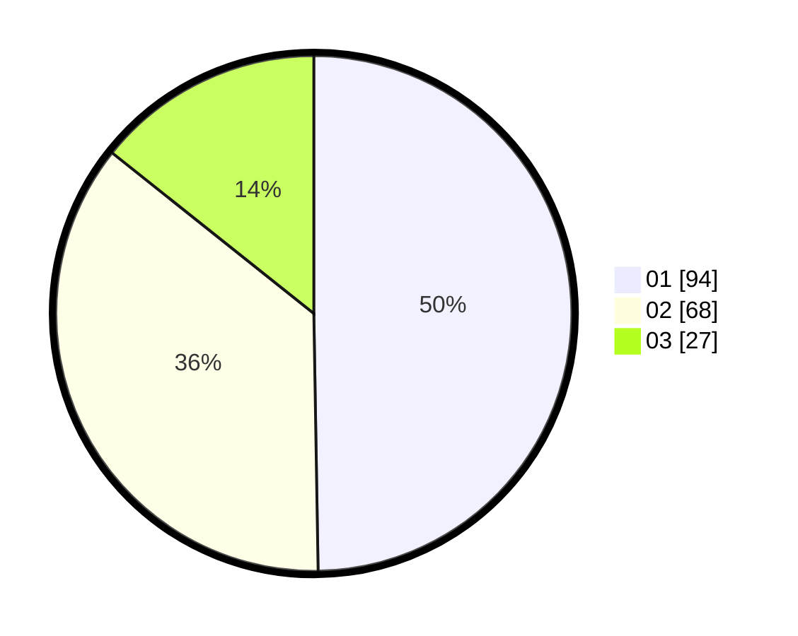

# Hasil

Hasil perolehan suara paslon dapat dilihat pada file paslon-01.txt, paslon-02.txt, dan paslon-03.txt.

Jika tidak ada, artinya data tersebut belum ada pada SIREKAP.

## Perolehan Suara

 * Paslon 01: **94**.
 * Paslon 02: **68**.
 * Paslon 03: **27**.

## Foto C Plano

https://sirekap-obj-formc.kpu.go.id/0325/pemilu/ppwp/31/71/01/10/06/3171011006017-20240217-185834--ff5bc02d-ed64-48db-b0dc-fe87f210574a.jpg

https://sirekap-obj-formc.kpu.go.id/0325/pemilu/ppwp/31/71/01/10/06/3171011006017-20240217-185836--87e88b73-52ca-4f77-a725-9f80f2eeaa64.jpg

https://sirekap-obj-formc.kpu.go.id/0325/pemilu/ppwp/31/71/01/10/06/3171011006017-20240217-185835--0d0d159e-f31f-49e8-82ee-c8f1a620d3d0.jpg

## DATA PEMILIH TETAP

Jumlah pemilih dalam DPT: **269**.
 * L: **139**.
 * P: **130**.

## DATA PENGGUNA HAK PILIH

Jumlah pengguna hak pilih dalam DPT: **190**.
 * L: **96**.
 * P: **94**.

Jumlah pengguna hak pilih dalam DPTb: **1**.
 * L: **0**.
 * P: **1**.

Jumlah pengguna hak pilih dalam DPK: **0**.
 * L: **0**.
 * P: **0**.

Jumlah pengguna hak pilih: **191**.
 * L: **96**.
 * P: **95**.

## JUMLAH SUARA SAH DAN TIDAK SAH

JUMLAH SELURUH SUARA SAH: **189**.

JUMLAH SUARA TIDAK SAH: **2**.

JUMLAH SELURUH SUARA SAH DAN SUARA TIDAK SAH: **191**.
