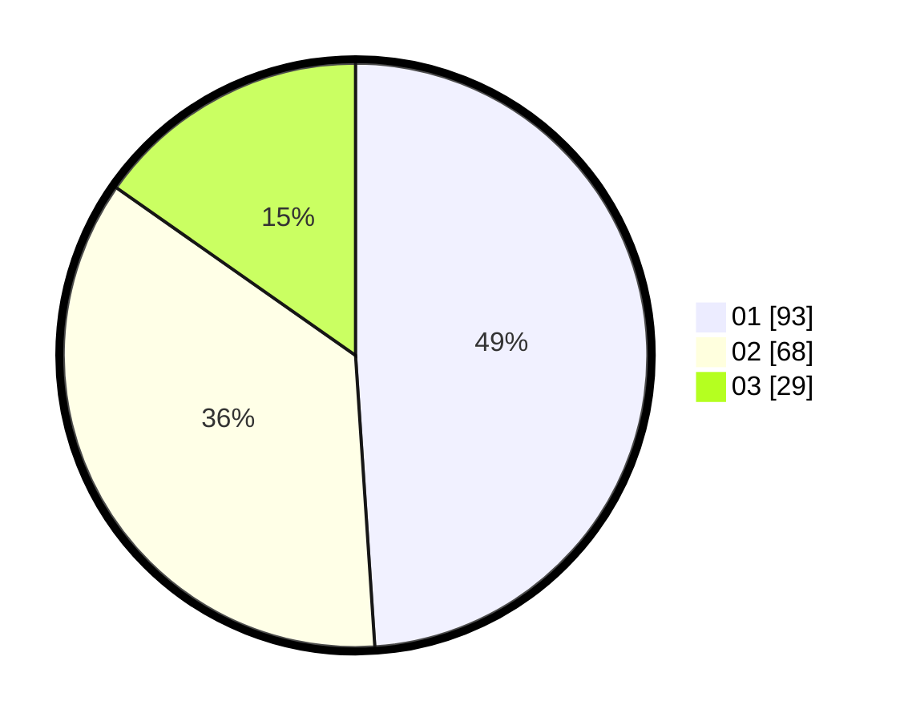

# Hasil

Hasil perolehan suara paslon dapat dilihat pada file paslon-01.txt, paslon-02.txt, dan paslon-03.txt.

Jika tidak ada, artinya data tersebut belum ada pada SIREKAP.

## Perolehan Suara

 * Paslon 01: **93**.
 * Paslon 02: **68**.
 * Paslon 03: **29**.

## Foto C Plano

https://sirekap-obj-formc.kpu.go.id/c3da/pemilu/ppwp/31/71/01/10/06/3171011006019-20240215-025326--53d9d3b3-162d-4e3b-a28c-eaa619db7164.jpg

https://sirekap-obj-formc.kpu.go.id/c3da/pemilu/ppwp/31/71/01/10/06/3171011006019-20240215-021727--8d5c8c68-6be0-44a9-8e30-708619d1cdc4.jpg

https://sirekap-obj-formc.kpu.go.id/c3da/pemilu/ppwp/31/71/01/10/06/3171011006019-20240215-022852--55c067b3-37d4-4cf7-9d28-8d032e7c4df6.jpg

## DATA PEMILIH TETAP

Jumlah pemilih dalam DPT: **271**.
 * L: **151**.
 * P: **120**.

## DATA PENGGUNA HAK PILIH

Jumlah pengguna hak pilih dalam DPT: **184**.
 * L: **99**.
 * P: **85**.

Jumlah pengguna hak pilih dalam DPTb: **1**.
 * L: **1**.
 * P: **0**.

Jumlah pengguna hak pilih dalam DPK: **5**.
 * L: **3**.
 * P: **2**.

Jumlah pengguna hak pilih: **190**.
 * L: **103**.
 * P: **87**.

## JUMLAH SUARA SAH DAN TIDAK SAH

JUMLAH SELURUH SUARA SAH: **190**.

JUMLAH SUARA TIDAK SAH: **0**.

JUMLAH SELURUH SUARA SAH DAN SUARA TIDAK SAH: **190**.
