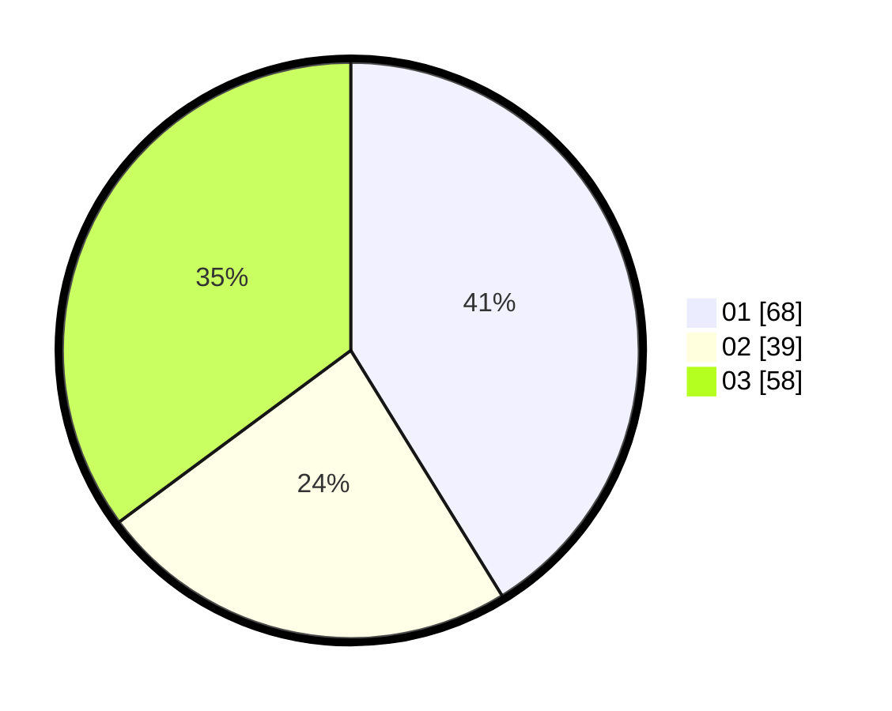

# Hasil

Hasil perolehan suara paslon dapat dilihat pada file paslon-01.txt, paslon-02.txt, dan paslon-03.txt.

Jika tidak ada, artinya data tersebut belum ada pada SIREKAP.

## Perolehan Suara

 * Paslon 01: **68**.
 * Paslon 02: **39**.
 * Paslon 03: **58**.

## Foto C Plano

https://sirekap-obj-formc.kpu.go.id/c411/pemilu/ppwp/31/71/01/10/06/3171011006021-20240216-025538--219f75c3-563e-4afd-8fc4-ddec692dfcd6.jpg

https://sirekap-obj-formc.kpu.go.id/c411/pemilu/ppwp/31/71/01/10/06/3171011006021-20240216-025543--34d89260-beec-4241-9cfe-67a153272c50.jpg

https://sirekap-obj-formc.kpu.go.id/c411/pemilu/ppwp/31/71/01/10/06/3171011006021-20240216-025542--8d51b58d-b47a-479c-ac07-4efc68e054aa.jpg

## DATA PEMILIH TETAP

Jumlah pemilih dalam DPT: **170**.
 * L: **88**.
 * P: **82**.

## DATA PENGGUNA HAK PILIH

Jumlah pengguna hak pilih dalam DPT: **169**.
 * L: **87**.
 * P: **82**.

Jumlah pengguna hak pilih dalam DPTb: **1**.
 * L: **1**.
 * P: **0**.

Jumlah pengguna hak pilih dalam DPK: **0**.
 * L: **0**.
 * P: **0**.

Jumlah pengguna hak pilih: **170**.
 * L: **88**.
 * P: **82**.

## JUMLAH SUARA SAH DAN TIDAK SAH

JUMLAH SELURUH SUARA SAH: **165**.

JUMLAH SUARA TIDAK SAH: **5**.

JUMLAH SELURUH SUARA SAH DAN SUARA TIDAK SAH: **170**.
