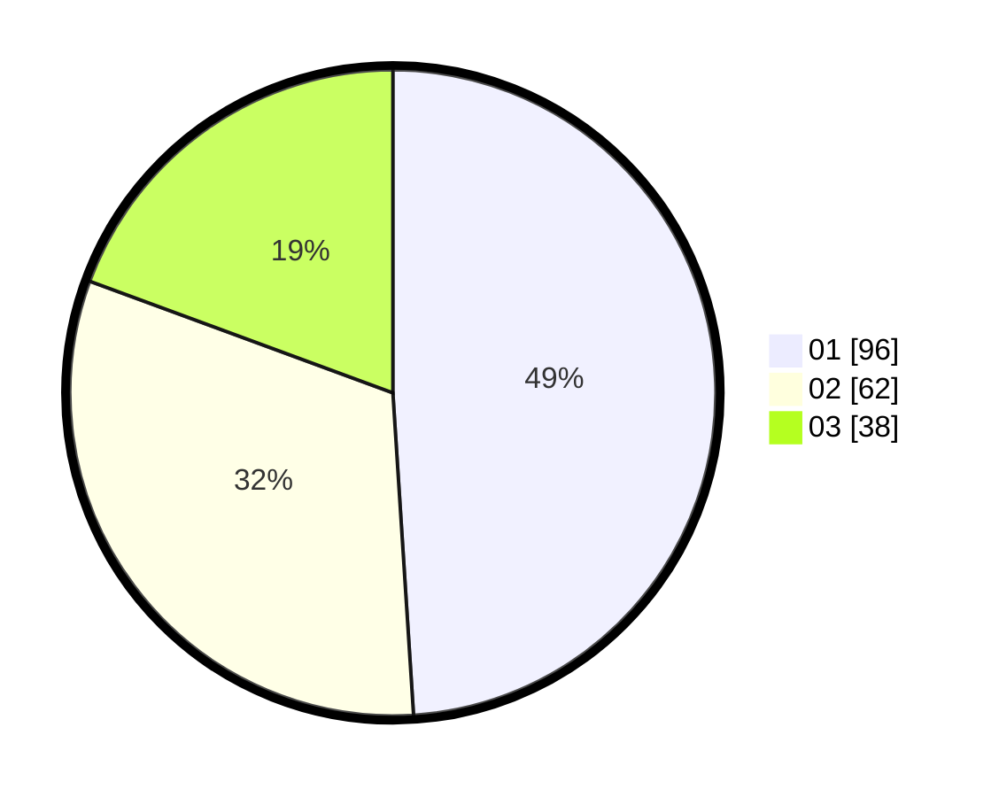

# Hasil

Hasil perolehan suara paslon dapat dilihat pada file paslon-01.txt, paslon-02.txt, dan paslon-03.txt.

Jika tidak ada, artinya data tersebut belum ada pada SIREKAP.

## Perolehan Suara

 * Paslon 01: **96**.
 * Paslon 02: **62**.
 * Paslon 03: **38**.

## Foto C Plano

https://sirekap-obj-formc.kpu.go.id/744e/pemilu/ppwp/31/71/01/10/06/3171011006023-20240215-233857--ac410e00-162b-43d7-ab5a-50da14895322.jpg

https://sirekap-obj-formc.kpu.go.id/744e/pemilu/ppwp/31/71/01/10/06/3171011006023-20240215-233859--6db98b72-9a6a-4a44-817c-9ba7e9dc268f.jpg

https://sirekap-obj-formc.kpu.go.id/744e/pemilu/ppwp/31/71/01/10/06/3171011006023-20240215-233857--6cdc4db1-fcc2-4da4-b253-565c70ea0872.jpg

## DATA PEMILIH TETAP

Jumlah pemilih dalam DPT: **260**.
 * L: **132**.
 * P: **128**.

## DATA PENGGUNA HAK PILIH

Jumlah pengguna hak pilih dalam DPT: **196**.
 * L: **96**.
 * P: **100**.

Jumlah pengguna hak pilih dalam DPTb: **1**.
 * L: **0**.
 * P: **1**.

Jumlah pengguna hak pilih dalam DPK: **1**.
 * L: **0**.
 * P: **1**.

Jumlah pengguna hak pilih: **198**.
 * L: **96**.
 * P: **102**.

## JUMLAH SUARA SAH DAN TIDAK SAH

JUMLAH SELURUH SUARA SAH: **196**.

JUMLAH SUARA TIDAK SAH: **2**.

JUMLAH SELURUH SUARA SAH DAN SUARA TIDAK SAH: **198**.
