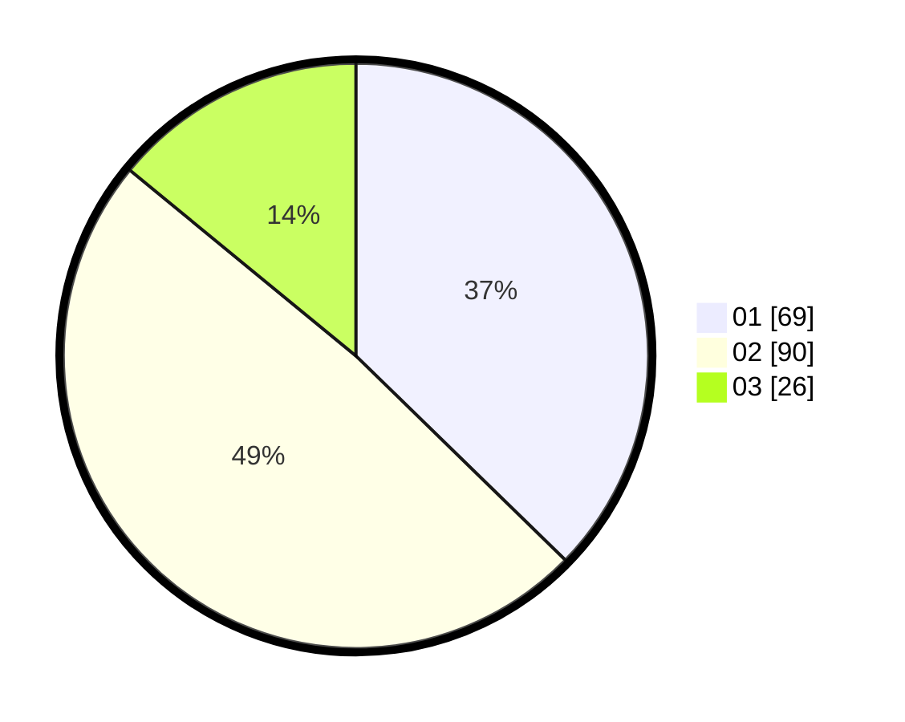

# Hasil

Hasil perolehan suara paslon dapat dilihat pada file paslon-01.txt, paslon-02.txt, dan paslon-03.txt.

Jika tidak ada, artinya data tersebut belum ada pada SIREKAP.

## Perolehan Suara

 * Paslon 01: **69**.
 * Paslon 02: **90**.
 * Paslon 03: **26**.

## Foto C Plano

https://sirekap-obj-formc.kpu.go.id/5115/pemilu/ppwp/31/71/01/10/06/3171011006024-20240214-194620--6702c65b-a0c2-4f58-b0da-aa20e6fbccbc.jpg

https://sirekap-obj-formc.kpu.go.id/5115/pemilu/ppwp/31/71/01/10/06/3171011006024-20240214-194804--dfdfbb66-80ae-4632-9c76-f42ab08cc06f.jpg

https://sirekap-obj-formc.kpu.go.id/5115/pemilu/ppwp/31/71/01/10/06/3171011006024-20240214-195058--073c318a-b4ed-48b2-8864-1fce7b0bde60.jpg

## DATA PEMILIH TETAP

Jumlah pemilih dalam DPT: **250**.
 * L: **121**.
 * P: **129**.

## DATA PENGGUNA HAK PILIH

Jumlah pengguna hak pilih dalam DPT: **189**.
 * L: **91**.
 * P: **98**.

Jumlah pengguna hak pilih dalam DPTb: **0**.
 * L: **0**.
 * P: **0**.

Jumlah pengguna hak pilih dalam DPK: **6**.
 * L: **3**.
 * P: **3**.

Jumlah pengguna hak pilih: **195**.
 * L: **94**.
 * P: **101**.

## JUMLAH SUARA SAH DAN TIDAK SAH

JUMLAH SELURUH SUARA SAH: **185**.

JUMLAH SUARA TIDAK SAH: **10**.

JUMLAH SELURUH SUARA SAH DAN SUARA TIDAK SAH: **195**.
