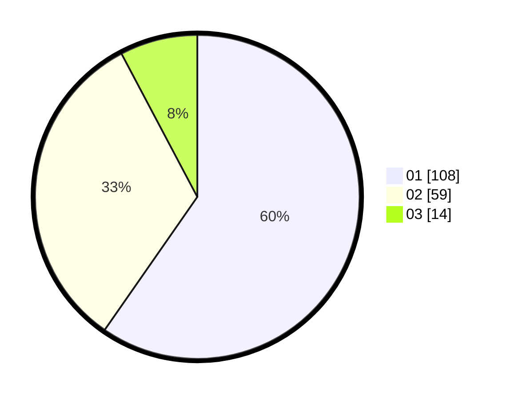

# Hasil

Hasil perolehan suara paslon dapat dilihat pada file paslon-01.txt, paslon-02.txt, dan paslon-03.txt.

Jika tidak ada, artinya data tersebut belum ada pada SIREKAP.

## Perolehan Suara

 * Paslon 01: **108**.
 * Paslon 02: **59**.
 * Paslon 03: **14**.

## Foto C Plano

https://sirekap-obj-formc.kpu.go.id/44bf/pemilu/ppwp/31/71/01/10/06/3171011006026-20240216-051943--0ca26b30-268d-4091-8e40-57ef5aad6b88.jpg

https://sirekap-obj-formc.kpu.go.id/44bf/pemilu/ppwp/31/71/01/10/06/3171011006026-20240216-051946--81ac7429-711a-461e-b262-bd65386a2aaa.jpg

https://sirekap-obj-formc.kpu.go.id/44bf/pemilu/ppwp/31/71/01/10/06/3171011006026-20240216-051945--55fda17d-c74b-4d63-97e1-8e9ee7bd076b.jpg

## DATA PEMILIH TETAP

Jumlah pemilih dalam DPT: **257**.
 * L: **144**.
 * P: **113**.

## DATA PENGGUNA HAK PILIH

Jumlah pengguna hak pilih dalam DPT: **184**.
 * L: **100**.
 * P: **84**.

Jumlah pengguna hak pilih dalam DPTb: **0**.
 * L: **0**.
 * P: **0**.

Jumlah pengguna hak pilih dalam DPK: **1**.
 * L: **0**.
 * P: **1**.

Jumlah pengguna hak pilih: **185**.
 * L: **100**.
 * P: **85**.

## JUMLAH SUARA SAH DAN TIDAK SAH

JUMLAH SELURUH SUARA SAH: **181**.

JUMLAH SUARA TIDAK SAH: **4**.

JUMLAH SELURUH SUARA SAH DAN SUARA TIDAK SAH: **185**.
