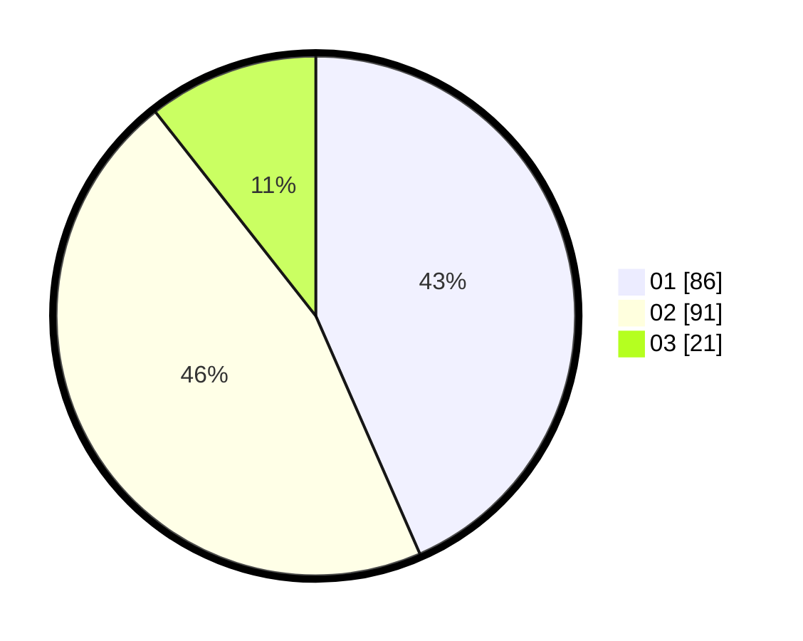

# Hasil

Hasil perolehan suara paslon dapat dilihat pada file paslon-01.txt, paslon-02.txt, dan paslon-03.txt.

Jika tidak ada, artinya data tersebut belum ada pada SIREKAP.

## Perolehan Suara

 * Paslon 01: **86**.
 * Paslon 02: **91**.
 * Paslon 03: **21**.

## Foto C Plano

https://sirekap-obj-formc.kpu.go.id/feff/pemilu/ppwp/31/71/01/10/06/3171011006031-20240216-015833--ac1e288b-12f8-46b7-ab94-a5663c3f5341.jpg

https://sirekap-obj-formc.kpu.go.id/feff/pemilu/ppwp/31/71/01/10/06/3171011006031-20240216-015835--46318e0b-f9a0-4d04-be9c-04d5d7df0120.jpg

https://sirekap-obj-formc.kpu.go.id/feff/pemilu/ppwp/31/71/01/10/06/3171011006031-20240216-015834--37ff4012-9d1b-4a4e-ba4f-ad4937f4be35.jpg

## DATA PEMILIH TETAP

Jumlah pemilih dalam DPT: **246**.
 * L: **120**.
 * P: **126**.

## DATA PENGGUNA HAK PILIH

Jumlah pengguna hak pilih dalam DPT: **202**.
 * L: **100**.
 * P: **102**.

Jumlah pengguna hak pilih dalam DPTb: **1**.
 * L: **1**.
 * P: **0**.

Jumlah pengguna hak pilih dalam DPK: **0**.
 * L: **0**.
 * P: **0**.

Jumlah pengguna hak pilih: **203**.
 * L: **101**.
 * P: **102**.

## JUMLAH SUARA SAH DAN TIDAK SAH

JUMLAH SELURUH SUARA SAH: **198**.

JUMLAH SUARA TIDAK SAH: **5**.

JUMLAH SELURUH SUARA SAH DAN SUARA TIDAK SAH: **203**.
