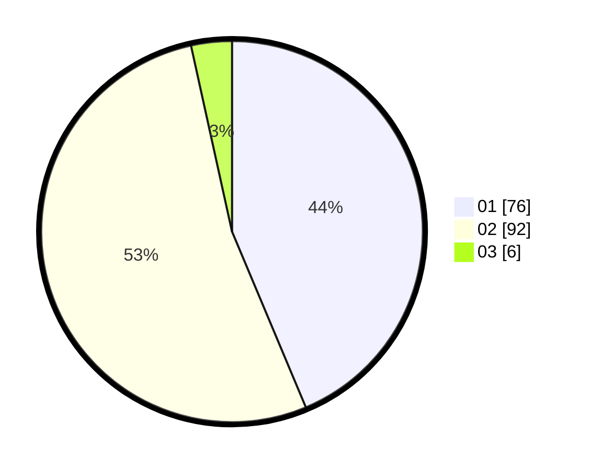

# Hasil

Hasil perolehan suara paslon dapat dilihat pada file paslon-01.txt, paslon-02.txt, dan paslon-03.txt.

Jika tidak ada, artinya data tersebut belum ada pada SIREKAP.

## Perolehan Suara

 * Paslon 01: **76**.
 * Paslon 02: **92**.
 * Paslon 03: **6**.

## Foto C Plano

https://sirekap-obj-formc.kpu.go.id/b39a/pemilu/ppwp/31/71/01/10/06/3171011006032-20240215-043108--1b8999fd-7768-498f-bbba-3331bb58e7b8.jpg

https://sirekap-obj-formc.kpu.go.id/b39a/pemilu/ppwp/31/71/01/10/06/3171011006032-20240215-043129--2f618700-135c-4be3-bc8a-96b670be3da6.jpg

https://sirekap-obj-formc.kpu.go.id/b39a/pemilu/ppwp/31/71/01/10/06/3171011006032-20240215-043119--26c3c3d5-e2fd-429a-ab72-2c81f9870ed2.jpg

## DATA PEMILIH TETAP

Jumlah pemilih dalam DPT: **258**.
 * L: **131**.
 * P: **127**.

## DATA PENGGUNA HAK PILIH

Jumlah pengguna hak pilih dalam DPT: **179**.
 * L: **83**.
 * P: **96**.

Jumlah pengguna hak pilih dalam DPTb: **0**.
 * L: **0**.
 * P: **0**.

Jumlah pengguna hak pilih dalam DPK: **1**.
 * L: **0**.
 * P: **1**.

Jumlah pengguna hak pilih: **180**.
 * L: **83**.
 * P: **97**.

## JUMLAH SUARA SAH DAN TIDAK SAH

JUMLAH SELURUH SUARA SAH: **174**.

JUMLAH SUARA TIDAK SAH: **6**.

JUMLAH SELURUH SUARA SAH DAN SUARA TIDAK SAH: **180**.
