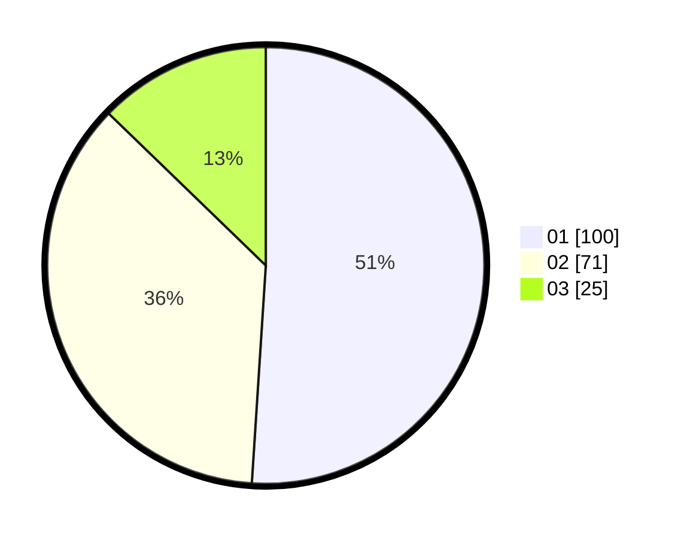

# Hasil

Hasil perolehan suara paslon dapat dilihat pada file paslon-01.txt, paslon-02.txt, dan paslon-03.txt.

Jika tidak ada, artinya data tersebut belum ada pada SIREKAP.

## Perolehan Suara

 * Paslon 01: **100**.
 * Paslon 02: **71**.
 * Paslon 03: **25**.

## Foto C Plano

https://sirekap-obj-formc.kpu.go.id/ae6f/pemilu/ppwp/31/71/01/10/06/3171011006033-20240214-204541--57541b30-1a9a-4ba5-916e-49d4fda337a9.jpg

https://sirekap-obj-formc.kpu.go.id/ae6f/pemilu/ppwp/31/71/01/10/06/3171011006033-20240215-100637--900b903d-da5d-4ecb-9c0d-2656ff936656.jpg

https://sirekap-obj-formc.kpu.go.id/ae6f/pemilu/ppwp/31/71/01/10/06/3171011006033-20240214-204704--2d106bdd-cc1e-437e-9e56-e7ec1c05fd9f.jpg

## DATA PEMILIH TETAP

Jumlah pemilih dalam DPT: **249**.
 * L: **128**.
 * P: **121**.

## DATA PENGGUNA HAK PILIH

Jumlah pengguna hak pilih dalam DPT: **196**.
 * L: **101**.
 * P: **95**.

Jumlah pengguna hak pilih dalam DPTb: **1**.
 * L: **1**.
 * P: **0**.

Jumlah pengguna hak pilih dalam DPK: **4**.
 * L: **3**.
 * P: **1**.

Jumlah pengguna hak pilih: **201**.
 * L: **105**.
 * P: **96**.

## JUMLAH SUARA SAH DAN TIDAK SAH

JUMLAH SELURUH SUARA SAH: **196**.

JUMLAH SUARA TIDAK SAH: **5**.

JUMLAH SELURUH SUARA SAH DAN SUARA TIDAK SAH: **201**.
