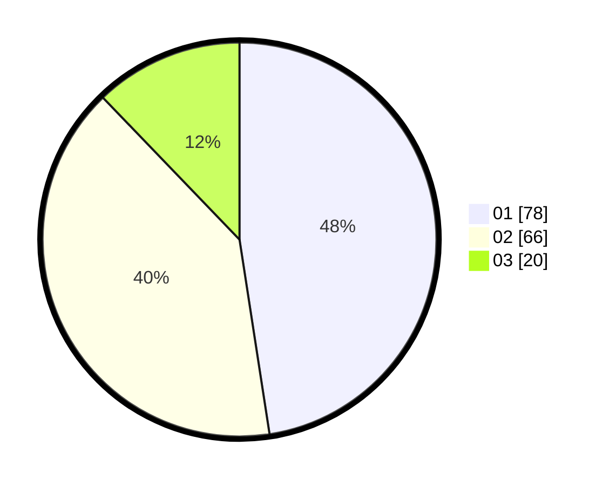

# Hasil

Hasil perolehan suara paslon dapat dilihat pada file paslon-01.txt, paslon-02.txt, dan paslon-03.txt.

Jika tidak ada, artinya data tersebut belum ada pada SIREKAP.

## Perolehan Suara

 * Paslon 01: **78**.
 * Paslon 02: **66**.
 * Paslon 03: **20**.

## Foto C Plano

https://sirekap-obj-formc.kpu.go.id/c6c1/pemilu/ppwp/31/71/01/10/06/3171011006034-20240216-020347--0d62bf11-7937-45c3-8102-4aec046699da.jpg

https://sirekap-obj-formc.kpu.go.id/c6c1/pemilu/ppwp/31/71/01/10/06/3171011006034-20240216-020349--c7230a44-147d-448c-90a4-dd3381e79d36.jpg

https://sirekap-obj-formc.kpu.go.id/c6c1/pemilu/ppwp/31/71/01/10/06/3171011006034-20240216-020348--16b2c07e-a4a3-4387-90b4-dced23e6d9a6.jpg

## DATA PEMILIH TETAP

Jumlah pemilih dalam DPT: **0**.
 * L: **0**.
 * P: **0**.

## DATA PENGGUNA HAK PILIH

Jumlah pengguna hak pilih dalam DPT: **0**.
 * L: **0**.
 * P: **0**.

Jumlah pengguna hak pilih dalam DPTb: **0**.
 * L: **0**.
 * P: **0**.

Jumlah pengguna hak pilih dalam DPK: **0**.
 * L: **0**.
 * P: **0**.

Jumlah pengguna hak pilih: **0**.
 * L: **0**.
 * P: **0**.

## JUMLAH SUARA SAH DAN TIDAK SAH

JUMLAH SELURUH SUARA SAH: **164**.

JUMLAH SUARA TIDAK SAH: **5**.

JUMLAH SELURUH SUARA SAH DAN SUARA TIDAK SAH: **169**.
