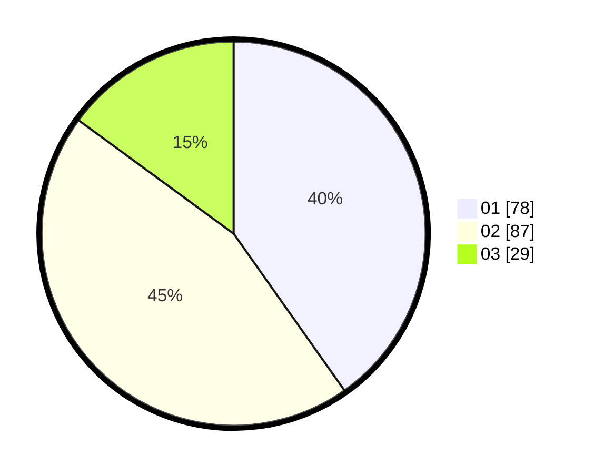

# Hasil

Hasil perolehan suara paslon dapat dilihat pada file paslon-01.txt, paslon-02.txt, dan paslon-03.txt.

Jika tidak ada, artinya data tersebut belum ada pada SIREKAP.

## Perolehan Suara

 * Paslon 01: **78**.
 * Paslon 02: **87**.
 * Paslon 03: **29**.

## Foto C Plano

https://sirekap-obj-formc.kpu.go.id/83d1/pemilu/ppwp/31/71/01/10/06/3171011006044-20240214-155229--9d6d72fb-9089-4217-9d08-a8fcc09319a8.jpg

https://sirekap-obj-formc.kpu.go.id/83d1/pemilu/ppwp/31/71/01/10/06/3171011006044-20240214-231339--e3759696-f7f2-4a36-a720-b546065de41b.jpg

https://sirekap-obj-formc.kpu.go.id/83d1/pemilu/ppwp/31/71/01/10/06/3171011006044-20240214-175326--faf9cfc3-a6c8-4421-bb60-9c1ac9eefb1a.jpg

## DATA PEMILIH TETAP

Jumlah pemilih dalam DPT: **261**.
 * L: **130**.
 * P: **131**.

## DATA PENGGUNA HAK PILIH

Jumlah pengguna hak pilih dalam DPT: **194**.
 * L: **91**.
 * P: **103**.

Jumlah pengguna hak pilih dalam DPTb: **0**.
 * L: **0**.
 * P: **0**.

Jumlah pengguna hak pilih dalam DPK: **2**.
 * L: **0**.
 * P: **2**.

Jumlah pengguna hak pilih: **196**.
 * L: **91**.
 * P: **105**.

## JUMLAH SUARA SAH DAN TIDAK SAH

JUMLAH SELURUH SUARA SAH: **194**.

JUMLAH SUARA TIDAK SAH: **2**.

JUMLAH SELURUH SUARA SAH DAN SUARA TIDAK SAH: **196**.
