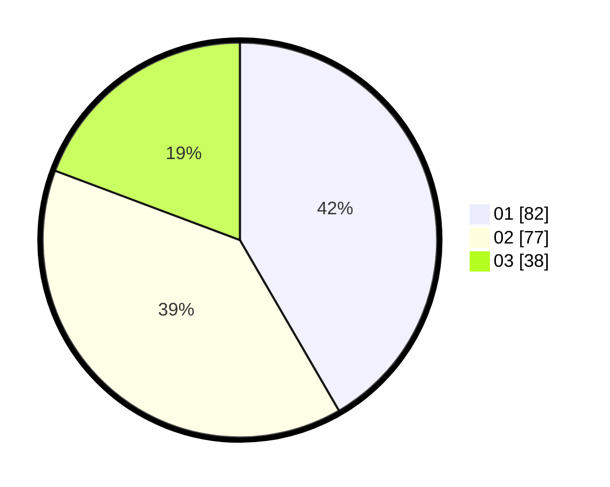

# Hasil

Hasil perolehan suara paslon dapat dilihat pada file paslon-01.txt, paslon-02.txt, dan paslon-03.txt.

Jika tidak ada, artinya data tersebut belum ada pada SIREKAP.

## Perolehan Suara

 * Paslon 01: **82**.
 * Paslon 02: **77**.
 * Paslon 03: **38**.

## Foto C Plano

https://sirekap-obj-formc.kpu.go.id/2559/pemilu/ppwp/31/71/01/10/06/3171011006045-20240214-160129--ee57bd50-008d-4286-a427-99b337bd9494.jpg

https://sirekap-obj-formc.kpu.go.id/2559/pemilu/ppwp/31/71/01/10/06/3171011006045-20240215-011607--f546c831-e069-48c6-a27f-3f83dc62864b.jpg

https://sirekap-obj-formc.kpu.go.id/2559/pemilu/ppwp/31/71/01/10/06/3171011006045-20240215-011657--a0e316ae-f2cb-48de-8ac4-b651e112808d.jpg

## DATA PEMILIH TETAP

Jumlah pemilih dalam DPT: **253**.
 * L: **134**.
 * P: **119**.

## DATA PENGGUNA HAK PILIH

Jumlah pengguna hak pilih dalam DPT: **192**.
 * L: **96**.
 * P: **96**.

Jumlah pengguna hak pilih dalam DPTb: **2**.
 * L: **0**.
 * P: **2**.

Jumlah pengguna hak pilih dalam DPK: **5**.
 * L: **4**.
 * P: **1**.

Jumlah pengguna hak pilih: **199**.
 * L: **100**.
 * P: **99**.

## JUMLAH SUARA SAH DAN TIDAK SAH

JUMLAH SELURUH SUARA SAH: **197**.

JUMLAH SUARA TIDAK SAH: **2**.

JUMLAH SELURUH SUARA SAH DAN SUARA TIDAK SAH: **199**.
