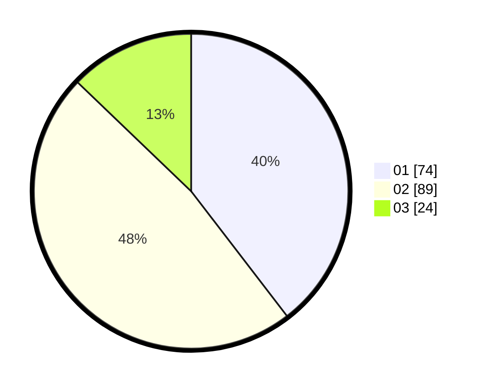

# Hasil

Hasil perolehan suara paslon dapat dilihat pada file paslon-01.txt, paslon-02.txt, dan paslon-03.txt.

Jika tidak ada, artinya data tersebut belum ada pada SIREKAP.

## Perolehan Suara

 * Paslon 01: **74**.
 * Paslon 02: **89**.
 * Paslon 03: **24**.

## Foto C Plano

https://sirekap-obj-formc.kpu.go.id/9625/pemilu/ppwp/31/71/01/10/06/3171011006046-20240214-212628--718ae33a-1a0f-4445-92a6-e4ea82d3fb53.jpg

https://sirekap-obj-formc.kpu.go.id/9625/pemilu/ppwp/31/71/01/10/06/3171011006046-20240214-212721--a8139044-f27c-4188-a91d-da1cac495648.jpg

https://sirekap-obj-formc.kpu.go.id/9625/pemilu/ppwp/31/71/01/10/06/3171011006046-20240214-212837--2f776136-2832-4f8f-8358-1c4eb2d22045.jpg
